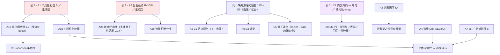

# G92 · 标准模型缺口总盘点（一份不重复计数的清单）

**日期**：本轮
**性质**：**盘点（inventory）**，不新增推导、不改动任何判定。把散在 [`STATUS`](STATUS.md) §2.2／§2.4、[`SYNTHESIS`](SYNTHESIS_zero_to_standard_model.md) §3、[`G91`](G91_matter_sector_range_and_three_way_verdict.md) §8、[`G63`](G63_target_list_and_audit.md) §1 四份清单里的缺口**合并成一份**，逐条消重、逐条给出**当前逻辑状态**与**可否证入口**。
**依赖**：[`Z0`](Z0_zero_never_rests_single_axiom.md)、[`Z13`](Z13_zero_foundation_missing_principle.md)、[`G12`](G12_gauge_sector_minimal_extension.md)、[`G57`](G57_unreachability_of_absolute_normalization.md)、[`G60`](G60_dimensionless_ledger_and_one_free_unit.md)、[`G91`](G91_matter_sector_range_and_three_way_verdict.md)、[`R16`](R16_direction_audit_reduction_tree.md)、[`R48`](R48_exact_cone_and_effective_cone.md)、[`R50`](R50_layer_discipline.md)、[`R86`](R86_reseed_class_verdict.md)、[`STATUS`](STATUS.md) §2.51。
**等级标签**：【本件】/**【盘点】**/【已证】/【条件】/【具名输入】/【不可导出】/【开放】/【更正】/【结论】。
**核验**：[`G92_check.py`](G92_check.py)。

$$
\begin{aligned}
&\text{全库缺口，}\textbf{合并去重后}\text{只有 }9\ \text{项是独立缺口，另有 }1\ \text{项结构性 no-go、}4\ \text{项互斥与冲突。}\\
&\textbf{承重的只有 }4\ \text{项};\quad \text{其中 }2\ \text{项是}\textbf{生成型}（\text{各自派生 }\ge2\ \text{个下游}）。\\
&\text{其余 }12\ \text{条"看起来是缺口"的，已证不可导出、已结算或本就不是缺口}。\\
&\text{标准模型栏（物质＋规范）在其中占 }1\ \text{项独立缺口（SM 门），已由 }[G91]\ \text{拆成 }19\ \text{个可审计项}。
\end{aligned}
$$

---

## §0 口径：这份清单相对既有四份清单做了什么

| 既有清单 | 它管什么 | 本件对它的处置 |
|:--|:--|:--|
| [`STATUS`](STATUS.md) §2.2「当前真正的承重项」 | 5 条优先级 | **并入**（本件把其中 2 条拆开、1 条改判） |
| [`STATUS`](STATUS.md) §2.4 `O1–O5` | 可发表主定理的五条证明义务 | **交叉标注**（列为各缺口的"交付形式"，不另计入） |
| [`SYNTHESIS`](SYNTHESIS_zero_to_standard_model.md) §3 缺口表 | 11 行 | **消重后并入**（其中 2 行被本件改判，见 §4） |
| [`G91`](G91_matter_sector_range_and_three_way_verdict.md) §8 | 物质栏 19 项 | **折叠为 1 项**（SM 门），细节引 `G91` |

**去重规则**（三条，防重复计数）：

$$
\text{① 同一对象只算一次（例：E3 源类 ＝ }\Gamma\text{-收敛的源侧，不是两项）};\\
\text{② 同一缺失原理的多个投影算一项（例：E1–E5 是同一个"选择／读出"的五个投影）};\\
\text{③ 「交付形式」不算缺口（例：}\Gamma\text{-收敛定理是 O1 的交付，不是独立缺口）}。
$$

---

## §1 Tier A：9 项**独立缺口**

> 字段：**逻辑状态**（`STATUS` §1 的统一状态词）／**承重**／**挡住什么**／**可否证入口**。

### A1 作用量相位 `ACTION-PHASE-MATCH`（$S$：无原生作用量）

| 字段 | 内容 |
|:--|:--|
| **逻辑状态** | **开放**（原样强预解形式**已排除**：`R13`） |
| **层** | L1／$\mathcal R$ |
| **生成型** | **是**——派生 A1a／A1b 两个下游 |
| **承重** | **是**（优先级 1 的生成型缺口） |
| **挡住** | 分支间相对相位、时间平移生成元 $H$、动力学、所有"类间"量子效应 |
| **依据** | `R33`（立项，三种等价形式 T1／T2／T3）／`R35`（类型判据反过来约束 $\pi$）／`R99`（**类内分级无效**，必须有类间相位） |
| **可否证入口** | 三种失败形态：F1 非几何／F2 非局域／F3 归一化自由（`R33` §）；二值指纹：$\operatorname{spec}(\log\Delta_T)$ 有限 vs 趋 $R$（`R34`／`R35`） |

**A1a（子项）** 几何模极限 $L1$：$K_B\to2\pi B_B$**

| 字段 | 内容 |
|:--|:--|
| **逻辑状态** | **开放**；原样强预解**已排除**（`R13` 证伪：$H_n=\log\frac{1-C_n}{C_n}$ 谱半径随 $N$ 线性发散）；type $III_1$ **未达**（原生满分支给 $III_{1/2}$，`R35`） |
| **承重** | **是**（`R8` 的 Jacobson 条件桥**决定性缺口**） |
| **挡住** | 模流＝几何 boost；$2\pi$ 归一化；面积律的绝对系数 |
| **依据** | `R8` §4／`R12` §2／`R13` ×2／`R14`（$Z$-CRIT-DER 五部件）／`R34` 定理 R34.1 |
| **可否证入口** | 极限因子类型（`R35` 判据：对数比生成子群 $\{0\}$／$c\mathbb Z$／稠密）；$\pi$ 的双侧约束是否可同时满足 |

**A1b（子项）** $\pi$：粗粒化轮廓

| 字段 | 内容 |
|:--|:--|
| **逻辑状态** | **开放 ＋ 一条不可能定理 ＋ 一条互斥** |
| **已经到手** | 阈值 $\lambda_1^\*=0.723607$（语境性）；类型要求"尾部非等差"；两层族（主导类 ＋ 幂律尾）可同时满足 |
| **仍缺** | **从 Zero 原生对象生成该形状** |
| **互斥（必须写明）** | `R44`：选维（生存窗口 $q<3/5$）与单体语境性（$q>3/5$）在 $q=3/5$ **相接不重叠**；逃生出口＝改账本形式（`R45`：39／64 个形式都能逃，代价是 `R32` 唯一性被削弱） |
| **依据** | `R35`／`R37`／`R42`／`R43`／`R44`／`R45`／`R49`（**旋转类恒 $III_\lambda$**：轨道权重全是 2 的幂 ⇒ 秩恒 1） |

### A2 复合系统／张量积／共同时间 `R-JOIN`

| 字段 | 内容 |
|:--|:--|
| **逻辑状态** | **开放 ＋ 一条定理（它不是"分解没选对"）** |
| **层** | 跨层 |
| **生成型** | **是**——派生 A2a／A2b 两个下游 |
| **承重** | **是** |
| **挡住** | 多体、Bell、纠缠熵的场地；一切"两方"物理 |
| **依据** | `R36`（现有二分割 CHSH 恒 $\le2$）／`R37`（单体语境性**成立**）／`R38`–`R41`（机制：共同起因 ＋ 未记录自由度，维数无关）／**`R86` §3** |
| **可否证入口** | `R38-3`：历史层对"位点"是失明还是记录（已裁决：**失明**，`R39`／`R40`）；CHSH 是否 $>2$ |

**A2a（子项）** 账本经典性 —— 本件对 `SYNTHESIS` §3 第 9 行的更正**

| 字段 | 内容 |
|:--|:--|
| **旧说法（作废）** | 「账本经典性（$\mathbb N$ 值重数）**已证**，且在 `Z0③` 下**不可闭合**，判为『$D=4$ 的对价』」——**这是 `R86` 自己撤回的说法**（其 §3 明确"第 9 项必须撤回：判据本身是空的"） |
| **当前准确说法** | 配分账本是 `Z0③` 的**非负整数重数**（经典计数对象）⇒ 导出的态 $\rho=\bigoplus_a\frac{\omega_a}{n_a}I$ **可分离** ⇒ **任何**分割上 $CHSH\le2$。**缺的不是代数分解，是"账本能不能取算符值"** |
| **代价路径（两条，互斥，都动底层条款）** | **甲**：账本算符值化（改写 `Z0③` 的"计数"条款）；**乙**：放弃"闭合只写类标签"，让记录保留词的相位（改写 `Z3` 的记录定义，且与 `G37` 的类级播种律冲突） |
| **精确边界** | **单体量子性不需要动 `Z0③`；多体量子性需要**（与 `G62` §5「$\hbar$ 是单位、结构可达」不冲突——那条只管单体） |
| **依据** | `R86` §3（本件只做转述与更正登记） |

**A2b（子项）** 张量积的**唯一性**（`B1`–`B12` 那一族外部路线）

| 字段 | 内容 |
|:--|:--|
| **逻辑状态** | **开放**；本体系内部**无记录** |
| **外部靶子** | Clifton–Bub–Halvorson 三条信息论约束只到运动学，**不给张量积唯一性**（[`SYNTHESIS`](SYNTHESIS_zero_to_standard_model.md) §5.2，**仅参考**） |

### A3 共形因子 $\Omega^2(x)$ 无来源

| 字段 | 内容 |
|:--|:--|
| **逻辑状态** | **开放（已正名）** |
| **已经到手** | 只到**共形类** $[g]$；闭环计数度规**零自由参数** |
| **已证障碍** | `R85`：单纯形上**必然各向异性** $D/(D+1)$ —— 局部各向同性**不可能**从当前构造得到 |
| **承重** | **是**（四维度规的定量间隔） |
| **依据** | `G57`／`R82`／`R85`／`G47`（细化极限） |
| **可否证入口** | 找到一个原生标量，它在细化下按 $\Omega^2$ 变换；或证明各向异性障碍不可绕（那就把 $\Omega^2$ 变成**定理级的输入**） |

### A4 选维 `DIM-SECTOR`（$D=4$）

| 字段 | 内容 |
|:--|:--|
| **逻辑状态** | **已证：`Z0` 条款集内部不能唯一选出四维**（`G89` 命题 1，分类级 no-go）；当前是**条件** |
| **条件候选链** | `R25`（成对账本窗口 $1/2<q<3/5$）→ `R31.1`（$L=4$ 唯一，$q=5/9$，峰 $=\{4\}$）→ `R32.1`（同一生存要求同时选出寄存器与寿命） |
| **仍然开放** | `PAIR-CARRIER-DER`（成对载体为何付代价）、`SURV4-GLOBAL`（全局生存峰）、`EVO-NORM`（绝对后代数／长期占比） |
| **已知张力** | `R44`／`R45`（账本形式与语境性互斥，39／64 形式可逃）；`R45` 之后"$D=4$"不再唯一钉住账本形式 |
| **本件新增加固** | `G91` 命题 G91.5：换成反射不变／全群不变账本，$L=4$ 仍是唯一解 |
| **承重** | **是**（O3） |

### A5 `E1` 站点／嵌入识别（含 $\Gamma$-收敛）

| 字段 | 内容 |
|:--|:--|
| **逻辑状态** | **I5a 已证／条件构造**（单值"类→物理点"识别**已证不可行**；无基点站点环与平衡对应**可构造**）；**I5b 开放**（带基点的物理嵌入） |
| **$\Gamma$-收敛** | **条件定理 R1-A／R1-B**：H1–H4 下紧性／$\Gamma$-liminf／恢复列／唯一极限**已证**；**H5 已由 `R6` 证明**；**H3／H7 已由 `R7` 条件闭合** |
| **仍缺** | I5b 站点嵌入；**GDL 局部密度极限**；Dirichlet 型 → 曲率作用量仍是**独立缺口** |
| **承重** | **是**（优先级 1；O1／O2） |

### A6 `E3` 源作用量类别

| 字段 | 内容 |
|:--|:--|
| **逻辑状态** | **具名输入** |
| **已排除** | 尘埃（不守恒）与耗散支；**场类存活但未选一** |
| **挡住** | 源侧；物质扇区的"作用量"这一层 |
| **依据** | `G5`–`G7`（守恒 $\iff$ 场方程，不是 $\iff$ 测地）／`G10` §6／`STATUS` §2.2 第 3 项 |
| **价签** | 买回物：源的作用量类别；代价：一笔具名输入 ＋ 无法由 `Z0` 选族 |

### A7 $\beta\varepsilon$／绝对刚度 $\delta$

| 字段 | 内容 |
|:--|:--|
| **逻辑状态** | **开放 ＋ 一条"R44 型" no-go**：$T^{ab}$ 的引入**没有**把 $\beta\varepsilon$ 钉在 $4/3$；各向同性方程给 $\beta\varepsilon^\*=\ln\frac32=0.405465$（精确），而它与**账本窗口** $(1.200,1.470)$ **互斥** |
| **结论（必须写明）** | **物质各向同性与维数峰不能共用同一个温度**（`R80` 的第二处 `R44` 型 no-go） |
| **挡住** | **一个数卡两条链**：语境性门槛 ＋ 物质各向同性 |
| **依据** | `R80`（$\ln\frac32$ 精确值 ＋ 互斥裁决）／`R84`／`R85`（各向异性 $D/(D+1)$）／`D247`（**仅参考**：剩余对象＝零缺陷形状 $Q^2$ ＋ 刚度数值 $\delta$） |

### A8 SM 门（物质 ＋ 规范扇区）

| 字段 | 内容 |
|:--|:--|
| **逻辑状态** | **已拆分**（`G91`）：**不可导出 5 ＋ 开放 3 ＋ 能导出 4 ＋ 只能具名输入 7 = 19 项** |
| **最硬的一条** | 规范群与表示内容**原理上不可导出（结构性）**：`G12` 引理 43 三条子论证 (a)(b)(c)，**都不依赖 $D=4$** |
| **最容易被误当缺口的一条** | 代计数 $k=3$：**两条 no-go**（`G91` 定理 G91.2 轨道计数与选维互斥；§7.5 反常给不出 3）＋**问题本身尚未定义**（`ONE-CLOSURE-ONE-GENERATION` 是未证候选） |
| **唯一确定落在射程内的** | 反常约束在 Zero 侧的可计算化（字典未写） |
| **依据** | `G91` 全文（本件只折叠为一项） |

### A9 物质扇区的**精确规则**（唯一剩下的"可动手"目标）

| 字段 | 内容 |
|:--|:--|
| **逻辑状态** | **开放（具名）**：写 $M_2(\mathbb C)\otimes\mathbb C^{T+1}$ 的**分级** ↔ 反常"六类表示槽"的**最小字典** |
| **为何它排在最前** | 它是物质栏里**唯一既不属"不可导出"、又不需要新公理**的目标（`G91` §6.3、§11 第 1 条） |
| **成功的判据** | 字典给出后，**至少一类**反常复形可被判为"原生不可实现" |

---

## §2 `X`：一条**结构性 no-go**（不是缺口，是墙）

### X1 内部方向与几何维数互斥

| 字段 | 内容 |
|:--|:--|
| **陈述** | $D=|F|(m-1)+1=4$ 的整数解只有 $(|F|,m-1)=(1,3)$ 与 $(3,1)$；而**参与几何的方向就是空间方向**（$H_Q$ 恰由全部可逆补偿方向张成）⇒ $|F|$ 不可能既提供几何方向又不计入 $D$ |
| **结论** | `Z0` 条款下 **$D=4$ 与规范扇区互斥**；最小扩展**必须**显式声明"内部方向不参与几何"（新公理 X） |
| **三条子论证** | (a) 新增可逆方向必成空间方向；(b) $S_m$ 不变量空间只有 $\operatorname{span}\{\mathbf 1\}$ 且 $Q(\mathbf 1)=m\ne0$（**规范单态与闭合态重合**）；(c) 全局置换 vs 局域变换 |
| **本件登记为候选的第四条** | `G91` §4.1(d)：手征性需复表示，而 $Z0$ 原语群的表示都是实／伪实——**未证，仅候选** |
| **若开口的代价** | ① 新公理 X；② 放弃识别 U 的连通性要求；③ 群／表示／超荷**仍全部是输入**（只买到"可谈论"） |

---

## §3 四项**互斥与冲突**（缺口之间打架，必须同时记账）

| # | 冲突 | 内容 | 出口 |
|--:|:--|:--|:--|
| 1 | **选维 vs 单体语境性** | `R44`：$q<3/5$ 给 $D=4$ 峰但 $S<2$；$q>3/5$ 给 $S>2$ 但峰 $\ge D=5$，**在 $q=3/5$ 相接不重叠** | 改账本形式（`R45`：39／64 可逃，代价＝唯一性削弱）；或 `R46`／`R47` 的单纯形路线（$C(D+1,2)$ ＋ 因果锥供签名） |
| 2 | **$L=4$ vs $L=8$** | 两个判据给两个寿命 | **已消解**（`R32.2`：$L=8$ 依赖的比较量已被撤回）——**保留在此只为防重提** |
| 3 | **旋转双覆盖 vs boost** | `R19`：旋转双覆盖**不**提供 boost；`R34.1`：**有限维**不承载 boost（失败原因是**维数**，不是 Zero） | P2′：细化极限须含 type $III$ 因子；但原生满分支给 $III_{1/2}$（`R35`） |
| 4 | **两条路线不可相加** | 主 `Z/G` 路线与 `D259` 借入路线**未证等价**（`R5`：无完整等价，只一条局部单向桥） | 不得把两边进度相加；`D259` 的未解输入保持路线本地 |

---

## §4 不是缺口：12 条已结算／已证不可导出／本就不是问题

> **这一节和 §1 一样重要**——它省掉试错。

| # | 事项 | 当前处置 | 依据 |
|--:|:--|:--|:--|
| 1 | $G,\Lambda$ **的数值** | **不可导出是定理**；登记为**单位／约定 E4**（Duff–Okun–Veneziano：量纲常数是 **unit** 不是 parameter） | `G57`／`G60` §1 |
| 2 | $\hbar$ **的数值** | **basic unit**；"导出其数值"**不是良定义问题**；良定义的是"为什么有作用量量子" | `G60` §1 |
| 3 | **绝对熵／温度** | 不再是缺口 | `STATUS` §2.3 |
| 4 | `I7` 电流记忆核 | **不承重**（有限速度由饱和与前沿速度提供） | `STATUS` §2.3 |
| 5 | `I6` 物质层洛伦兹 | **并入 I7**，不再单列 | `STATUS` §2.3 |
| 6 | `I11` 年龄到半径的旧映射 | 在该旧路线内**为 no-go**；当前几何标号路线已绕开（**但不等于二者已证等价**） | `STATUS` §2.3 |
| 7 | `I8` 重播种条款 | 作为条款**已由 Z0 导出**；旧"它是输入／公理"的说法一律撤回 | `STATUS` §2.3 |
| 8 | **精确锥** | **已结算**（`R48`）：支持锥**一直是精确的**（引理 R48-1，$B$ 无关）；缺的是**锥边可见性** $\varepsilon(B)=\frac12\log(4/B)$，三区制，$B=4$ 是**自洽条件** | `R48`／`G59` |
| 9 | **连续极限的可攻性** | I2a＝I5（**同一输入**）："形状正则 ⇒ 形状收敛"未证，但属**经典范畴，不需新公理** | `G18` 引理 70 |
| 10 | **Fermi 点／加倍** | **平移不变性不成立** ⇒ Nielsen–Ninomiya 的前提不满足；物理格点恒 1 个零模 ⇒ **单粒子层面没有加倍** | `E1_NN` |
| 11 | **boost 的"Zero 缺陷"说法** | 失败原因是**维数**（任何有限维代数都缺 boost），**不是 Zero** | `R34` |
| 12 | `D=4$ vs $L=4` 的"最小性"依赖 | `L=4` 现有**不依赖最小性**的判据（`R31.1`＋`G91` 命题 G91.5） | `R31`／`G91` |

---

## §5 依赖结构：全库缺口只有**三个根**

> 口径：本节的"根"是**归约树上的根**，不是新计数。归约树本身见 [`R16`](R16_direction_audit_reduction_tree.md)（已证：开放具名簇停在 **8**，选择型输入稳定为 **5**，R15 不新增独立缺口）；本件只把 8 个簇的**上游**画出来。



**读法**：

$$
\textbf{根 1 与根 2 是"生成型"}（\text{各自派生 } \ge2\ \text{个下游}）;\quad
\textbf{根 3 是墙};\quad \text{其余 }6\ \text{项是}\textbf{单点缺口}。
$$

**给标准模型的直接含义**：

$$
\text{即使 A1／A2／A3／A4／A7 全部关闭，}\textbf{规范群与表示内容仍然不会由此得到}——
\text{它们卡在根 3（}X1\text{），}\text{而根 3 是一条 no-go，不是一道待算题。}
$$

---

## §6 可否证性分级：哪些缺口"一动就有结果"

| 级别 | 判据 | 缺口的当前状态 |
|:--|:--|:--|
| **I 二值可判** | 跑一个有限枚举／一个数值指纹即可翻转 | A1b（$\pi$ 的双侧约束）；A2a（CHSH）；A9（字典）；§3 冲突 1 |
| **II 有限扫描** | 扫一个有限参数域即可 | A4（账本形式 × 寿命）；A3（各向同性障碍） |
| **III 需新构造** | 必须先造出对象才谈得上判定 | A1／A1a（连续极限的类型）；A5（I5b 嵌入）；A6（源类） |
| **IV 已判死／不可导出** | 再挖是方向错误 | A8 的"不可导出 5 项"；§4 全部 12 条 |

**当前最值得动手的三个**（按"一动就有结果"排序）：

1. **A9**（反常字典）——唯一确定落在射程内、且不需新公理；
2. **A2a**（账本经典性）——已给出**两条互斥代价路径**，选哪条是一个**可辩论的决定**，不是待算题；
3. **A1b**（$\pi$ 的原生形状）——两条尺子已经架好（主导类要粗、尾部要细），缺的是从 Zero 层结构生成它。

---

## §7 诚实边界

1. **本件是盘点，不是推导。** 它不关闭任何缺口、不抬高任何状态、不新增具名输入。
2. **计数口径**：§1 = 9 项独立缺口；§2 = 1 项 no-go；§3 = 4 项互斥／冲突；§4 = 12 条非缺口。**三者不可相加**（§3 的冲突是 §1 项之间的关系，不是新的缺口）。
3. **§1 的 9 项与 `SYNTHESIS` §3 的 11 行不是同一口径**：本件把 `SYNTHESIS` 的第 9 行**改判**（旧说法已被 `R86` 自己撤回）并把 SM 门**折叠为一项**。引用缺口数时**引本表**。
4. **`R16` 的"开放具名簇 8"与本件的"9 项"不冲突**：前者数的是归约树的簇（含选择型输入），后者数的是**独立缺口**（已剔重复与交付形式）。
5. **根的分类（§5）是本件的整理，不是新定理**：三条子论证与两条代价路径都是既有结果，本件只画了上游。
6. **`H1`–`H10`（上一轮会话）不入本表**：它们属社会／金融移植方向，且 `H9` 的判定是"Zero 对经济危机目前既无机制、也无移植路径"，不改变任何承重判定。**这 10 篇仍未登记进 `INDEX`／`STATUS`**——这是账务欠账，不是理论缺口。

---

## §8 核验

```
python3 G92_check.py
```

检查：文档结构（Tier A 九项、X1、四项冲突、十二条非缺口、根结构）；**计数自洽**（9／1／4／12 与正文一致）；**逐条锚定**（每一行的依据文件与关键词在磁盘上实际存在）；**交叉一致**（与 `G91` §8 的 19 项、`STATUS` §2.2／§2.4、`SYNTHESIS` §3、`R86` §3 的**改判**逐条对齐）；**登记**（`STATUS.md` §2.52 与 `INDEX.md` 已收录）。
