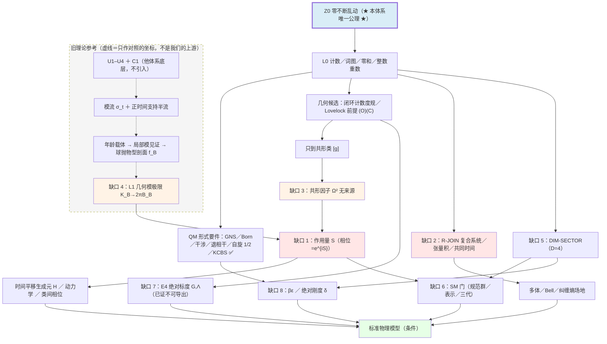

# 综合参考 · 从 Zero 推导标准物理模型：路线图与文献清单

**日期**：2026-10-04
**性质**：**参考（推导路线图 ＋ 文献清单）**。不新增公理、不改动任何既有判定。
**触发**：用户指示——「从 Zero 推导标准物理模型，推之前先看理论的文章作参考」。

---

## §-1 范围红线（**先读这一节**）

$$

\begin{aligned}
&\textbf{本体系的底层只有 } \text{Z0} \text{ 一条（「零不断乱动」）。}\\
&\textbf{任何旧理论的底层条款一律不进本体系}——\text{只作参考、对照与文献。}\\
&\text{参考 ≠ 前提};\quad \text{对照 ≠ 汇流};\quad \text{外部结论 ≠ 本体系定理。}
\end{aligned}
$$

| 允许 | 不允许 |
|:--|:--|
| 读旧理论的**结论**，当作「我们的推导该落在哪里」的**靶子与尺子** | 把旧理论的底层条款（如 `U1–U4`）写成本体系的第二条公理或并列上游 |
| 引用旧理论的**否证性定理**，用来判断某目标是否已死 | 把旧理论的条件恢复**记成**我们的成果（进度不可相加） |
| 借旧理论的**技术**（工具、判据、数值），但必须重新在我们的底层上导出 | 把「两边在同一个对象上会合」写成「两条路线等价」 |

**本文件的一切参考内容都是外部材料**，包括：

| 名称 | 位置 | 地位 | 规模 |
|:--|:--|:--|:--|
| **零和宇宙（我们）** | `/Users/oygb/Downloads/lh/` | **本体系**：唯一公理 `Z0`（1 条） | `Z*`18 ＋ `G*`91 ＋ `D2xx`50 ＋ `R*`102 篇 |
| **模平衡纲领（旧理论，参考）** | `/Users/oygb/Downloads/modular-equilibrium/` | **外部参考**：其底层 `U1–U4 ＋ C1`（4 条 ＋ 1 约定）**与本体系不同，不引入** | `D1–D259` 259 篇 ＋ `verify/` 260 脚本 |

> **为什么仍要看它**：它是目前唯一把「到标准物理模型」写成**逐项验收标准**（六道恢复门）的材料，因此可以用作**缺口清单的尺子**。但它的 `U1–U4` 是**另一条底层的选择**，不是 `Z0` 的推论，也不是 `Z0` 的上游。

---

## §0 一句话判定

$$

\begin{aligned}
&\textbf{唯一底层是我们自己的 } \text{Z0} \text{（「零不断乱动」）；旧理论的底层（} \text{U1–U4} \text{）} \textbf{不引入}。\\
&\text{旧理论（参考）唯一有用的东西：它把"到标准物理模型"拆成了可逐项审计的六道恢复门}\\
&\qquad\Longrightarrow\ \text{拿它当}\textbf{缺口清单的尺子}。\\
&\textbf{我们这边}：\text{"零"给的是计数与多重性，}\textbf{给不出作用量}。\\
&\therefore\ \textbf{下一步不是继续推，而是先定位链上的断点，并补 } \text{S} \text{（作用量）与 } \text{R-JOIN} \text{（复合）两关。}
\end{aligned}
$$

**当前可发表的主张**（**只引我们自己的状态源**）：

> 在主路线 `Z/G` 中，采用「输入可有，但必须具名并付价签」的政策后，在 `Z0 + 识别 U + E1/E2/E3/E4 + 参数 L,T,N` 下，**条件推出**四维 GR 的结构、Lovelock 场方程、守恒源与有限前沿锥。（[`STATUS.md`](STATUS.md) §0）

> **旧理论参考材料的自我声明**（只作参考坐标，**不是**本文件的前提，也**不是**我们的成果）：该纲领自述「本纲领可以主张『给定观测分支后，结构和动力学可恢复并可计算』，不能主张『上游已经唯一选出观察者看到的那一支』或『第一因已经导出』」。（`modular-equilibrium/AXIOMS.md` §0.3）

**不能主张**：从「零不断乱动」无条件、无输入地导出四维 GR 或标准模型。

---

## §1 本地材料清单（分诊）

### 1.1 `lh` —— 最底层（公理与离散骨架）

| 文件 | 是什么 | 为什么要看 |
|:--|:--|:--|
| [`Z0_zero_never_rests_single_axiom.md`](Z0_zero_never_rests_single_axiom.md) | **唯一公理** ＋ Z1–Z5 的全部导出 ＋ 价目表 | **一切的起点**；「不设概率」是力量与贫困同源的那一款 |
| [`Z1_zero_layer_as_the_foundation.md`](Z1_zero_layer_as_the_foundation.md) | 词／图／散度字典／零和守恒／闭合判据 | 离散骨架的定理集 |
| [`Z13_zero_foundation_missing_principle.md`](Z13_zero_foundation_missing_principle.md) | **「Zero 缺的不是公理条数，而是选择／读出原理」** | **最重要的一篇**：把「一切『哪一个』问题」收成 E1–E5 |
| [`Z17_A0_A5_retirement_vacancy_ledger.md`](Z17_A0_A5_retirement_vacancy_ledger.md) | A0–A5 退场后的空缺账本 | 家谱卫生 |
| [`G0_bottom_layer_and_derivation_route.md`](G0_bottom_layer_and_derivation_route.md) §0.1 | 底层条款表 ＋ 家谱映射（权威） | 引用条款只引这里 |
| [`G10_final_derivation_and_input_ledger.md`](G10_final_derivation_and_input_ledger.md) | 最终推导 ＋ 输入总账 | 经典几何侧的收口 |
| [`G63_target_list_and_audit.md`](G63_target_list_and_audit.md) | **对照清单：本标准物理本该预言的量** | 直接服务「标准物理模型」这一目标 |
| [`G70_B_and_tau_closing.md`](G70_B_and_tau_closing.md) §5 | 参数与目标清单的当前数字（21 已关闭／2 开放／3 口径） | 当前唯一的计数口径 |

### 1.2 `lh` —— 到 GR 的推导（`G*`）

| 文件 | 是什么 |
|:--|:--|
| [`G1_derivations_from_the_bottom_layer.md`](G1_derivations_from_the_bottom_layer.md) | 由底层条款导出的**全部**东西（含引理 5 的号差分裂 $\mathbb R\_\tau\oplus H\_Q$） |
| [`G40_metric_from_closed_walk_counting.md`](G40_metric_from_closed_walk_counting.md) | 度规的**唯一候选来源**：闭环计数 $N^{(k)}\_{ij}=kA\_{ij}(A^{k-1})\_{ij}$ |
| [`G41_lovelock_premises_under_nonuniform_weight.md`](G41_lovelock_premises_under_nonuniform_weight.md) | Lovelock 前提 $(L)(O)(C)$ ＋ **三角困境**（局域／度规由数据导出／不引入偏好三者不可兼得） |
| [`G57_unreachability_of_absolute_normalization.md`](G57_unreachability_of_absolute_normalization.md) | **绝对标度不可导出**（定理） |
| [`G59_I7_settled_native_cone_and_its_residue.md`](G59_I7_settled_native_cone_and_its_residue.md) | 原生态锥与残余 |
| [`G89_dimension_no_go_and_the_balance_condition.md`](G89_dimension_no_go_and_the_balance_condition.md) | **选维 no-go** ＋ 平衡条件 |
| [`G62_quantum_sector_from_GNS_modular_flow_gleason.md`](G62_quantum_sector_from_GNS_modular_flow_gleason.md) | **量子扇区**：GNS ＋ 模流 ＋ Gleason |
| [`G72_kappa1_from_the_ledger.md`](G72_kappa1_from_the_ledger.md) | $K=-\log\omega$ **由整数计数唯一确定、无自由参数** |

### 1.3 `lh` —— 主定理接口与缺口审计（`R*`）

| 文件 | 是什么 | 关键判定 |
|:--|:--|:--|
| [`R0_publication_theorem.md`](R0_publication_theorem.md) | **可发表主定理接口**：五条证明义务 O1–O5 ＋ 门槛 M0–M4 | 投稿只能写成「条件重建定理」 |
| [`R9_external_GR_derivations_landscape.md`](R9_external_GR_derivations_landscape.md) | **外部 GR 推导路线排序 ＋ 16 条带 DOI 的参考文献** | 首选 Jacobson 2016，次选 Cao-Carroll 2018 |
| [`R8_jacobson_entanglement_equilibrium_completion.md`](R8_jacobson_entanglement_equilibrium_completion.md) | 用 Zero 补 Jacobson 2016 的前提 | 精确熵差恒等式已证；L1／L5 未关闭 |
| [`R10_cao_carroll_bulk_entanglement_completion.md`](R10_cao_carroll_bulk_entanglement_completion.md) | Cao-Carroll 2018 的条件桥 | 只到弱场线性化 |
| [`R11_legacy_GR_derivation_audit.md`](R11_legacy_GR_derivation_audit.md) | 旧理论与历史 GR 推导审计（含 `modular-equilibrium`） | 可迁移部件与失败边界 |
| [`R33_action_phase_match_project.md`](R33_action_phase_match_project.md) | **`ACTION-PHASE-MATCH` 立项**：(T1) 模流＝几何流／(T2) 相位 $=e^{iS\_{\rm geo}}$／(T3) $K\_\omega=c\,G\_{\rm geo}$, $c=2\pi$ | **最大缺口在此立项，未证** |
| [`R34_finite_dimensional_boost_obstruction.md`](R34_finite_dimensional_boost_obstruction.md) | **定理**：非紧半单 Lie 群无非平凡有限维酉表示 ⟹ 有限维**不可能**承载 boost | 缺口是**维数**而非 Zero |
| [`R35_type_iii_classification.md`](R35_type_iii_classification.md) | 极限因子的**类型**由粗粒化轮廓决定；原生满分支给 $III\_{1/2}$（不是 $III\_1$） | 反向约束 $\pi$ |
| [`R36_chsh_bell_locality.md`](R36_chsh_bell_locality.md)／[`R37`](R37_kcbs_contextuality.md)／[`R38`](R38_entanglement_from_shared_closure_origin.md) | CHSH（Bell 局域）／KCBS（**单体语境 ✅**）／纠缠机制（共同起因＋未记录自由度，$S=2\sqrt2$） | 单体量子性成立；多体缺场地 |
| [`R44_survival_vs_contextuality_no_go.md`](R44_survival_vs_contextuality_no_go.md) | **no-go**：选维（生存）与单体语境性在洛伦兹字典内**互斥** | 出口＝改账本形式 |
| [`R46_pair_ledger_objects_and_simplex.md`](R46_pair_ledger_objects_and_simplex.md)／[`R47`](R47_signature_from_causal_cone.md)／[`R74`](R74_euclidean_simplex_settlement.md) | 欧氏单纯形字典 $C(D+1,2)$ ＋ 签名由因果锥供出 ⟹ **$D=4$ 峰与单体语境性同时闭环** | 条件解 |
| [`R82_conformal_gap_memo.md`](R82_conformal_gap_memo.md) | **卡点正名**：不是「度规构造失败」，而是**共形因子 $\Omega^2(x)$ 无来源** | 五条路径统一读作「只到共形类」 |
| [`R85_local_isotropy_verdict.md`](R85_local_isotropy_verdict.md) | **定理**：单纯形上逐顶点局部刚度**必然各向异性**，值 $D/(D+1)=0.8$ | 障碍在单纯形自身星形几何 |
| [`R95_layer_table_and_discipline.md`](R95_layer_table_and_discipline.md) | **层表单一来源**：L0／L1／L1′／L2 ＋ $\mathcal R$（导出记号） | 比较任何量前先对齐层 |
| [`R96_quantum_inventory.md`](R96_quantum_inventory.md)／[`R102_quantum_gap_recount.md`](R102_quantum_gap_recount.md) | 量子栏盘点 | **最大缺口＝作用量**（一个缺口生成三个） |
| [`R50_layer_discipline.md`](R50_layer_discipline.md) | 分层纪律：断言带层指标 | 层坍塌优先于改结论 |

### 1.4 旧理论参考材料（`modular-equilibrium`）—— **只读结论作靶子，不引入其底层**

> **红线复述**：下列文件的地位是**外部参考**。它们的 `U1–U4` **不是** `Z0` 的推论，**不并入**本体系。读它们的唯一目的是：① 借它的**恢复门清单**当缺口尺子；② 看它把哪些目标**证成了 no-go**（省得重复撞墙）；③ 找可迁移**技术**，迁回后必须在 `Z0` 上重新导出。

| 文件 | 是什么 | 作为参考的用法 |
|:--|:--|:--|
| [`AXIOMS.md`](../modular-equilibrium/AXIOMS.md) | 其底层 `U1–U4 ＋ C1`；§3 **六道恢复门**（QM／QFT／**SM**／GR／TD／OBS）；§4 恢复结构账；§6 GR 边界；§8 当前路线 | **当缺口清单的尺子用**：拿它的验收标准问「`Z0` 路线走到哪一格了」。**不采用**它的上游 |
| [`D29_upstream_rebase.md`](../modular-equilibrium/derivations/D29_upstream_rebase.md) | 该纲领的上游重定基 | 对照：它选了「代数＋态」当底，我们选了「运动＋计数」当底 |
| [`D30_observed_branch.md`](../modular-equilibrium/derivations/D30_observed_branch.md) | 观测分支 `R-BRANCH` | 「哪一个」问题的另一种写法；与我们的 E1–E5 对照 |
| [`D24_equilibrium_to_einstein.md`](../modular-equilibrium/derivations/D24_equilibrium_to_einstein.md) | 平衡 → Einstein 方程（其条件链） | 外部对照，对应 `lh` 的 R8／R10；**不计入** O1–O5 |
| [`D45_standard_model_anomaly_complex.md`](../modular-equilibrium/derivations/D45_standard_model_anomaly_complex.md) | 一代左手物质的六类局域反常复形 | **物质扇区唯一「硬约束」来源**；可迁移的是**约束**，不是其底层 |
| [`D47_anomaly_selection_boundary.md`](../modular-equilibrium/derivations/D47_anomaly_selection_boundary.md)／[`D48`](../modular-equilibrium/derivations/D48_small_chiral_anomaly_block.md) | 反常选择边界；存在 **14 态无反常手征块，不是 SM 一代** | **否证性参考**：反常不能禁止新物质 |
| [`D49_gauge_origin_cost_table.md`](../modular-equilibrium/derivations/D49_gauge_origin_cost_table.md) | 规范来源三路成本表（乘积／统一／自同构） | 三路都要新增结构 ⟹ 提醒我们「写出 $SU(3)\times SU(2)\times U(1)$ ≠ 导出它」 |
| [`D50_charge_quantization_classification.md`](../modular-equilibrium/derivations/D50_charge_quantization_classification.md) | 电荷量子化分类；$Q\in\frac13\mathbb Z$ 需额外中心相容 | 约束参考 |
| [`D52_generation_origin_classification.md`](../modular-equilibrium/derivations/D52_generation_origin_classification.md) | **三代来源分类**：反常与 Witten 条件都不能选出 $k=3$ | **否证性参考**：代计数缺口是真的，别指望反常 |
| [`D53_yukawa_closure.md`](../modular-equilibrium/derivations/D53_yukawa_closure.md)／[`D59`](../modular-equilibrium/derivations/D59_flavor_moduli_selection_no_go.md) | Yukawa 闭合；味模空间选择 no-go | 质量层级无规范来源 |
| [`D57_gauge_connection_yang_mills.md`](../modular-equilibrium/derivations/D57_gauge_connection_yang_mills.md) | 联络 ＋ Yang-Mills（唯一宇称偶两阶规范动力学） | 可迁移的**唯一性论证**（迁回后须在 `Z0` 上重证） |
| [`D61`](../modular-equilibrium/derivations/D61_gauge_quantization_brst.md)／[`D65`](../modular-equilibrium/derivations/D65_renormalized_brst_slavnov_taylor.md)／[`D74`](../modular-equilibrium/derivations/D74_gribov_ambiguity_nonperturbative_measure.md) | BRST ／ STI ／ Gribov | 非微扰测度未建 |
| [`D112`](../modular-equilibrium/derivations/D112_weak_mixing_angle_selector.md)／[`D113`](../modular-equilibrium/derivations/D113_gauge_kinetic_normalization.md)／[`D115`](../modular-equilibrium/derivations/D115_weak_angle_scale_anchor.md) | $\sin^2\theta\_W=3/8$ 高能条件；低能 $0.23122$ 需尺度锚 $M\_U\approx1.03\times10^{13}$ GeV | 数值对照；注意它是**由观测角反解**的，不是上游预言 |
| [`D138_finite_geo1_crossed_product_skeleton.md`](../modular-equilibrium/derivations/D138_finite_geo1_crossed_product_skeleton.md) | 有限交叉积骨架 | **技术参考**：交叉积给了它 $M\_T(\mathbb C)$；我们这边 `lh/D212`／`D221` **独立**也得到同一个载体——两边在**同一个对象**上会合，但这**不是**路线汇流 |
| [`D192_zero_sum_conversion_dynamics.md`](../modular-equilibrium/derivations/D192_zero_sum_conversion_dynamics.md) | 零和转化的无偏好最小核；建造偏置可来自约束图的邻域度（$\pi(0,0,0)/\pi(-2,0,2)=2$） | **该纲领里唯一直接用零和对象的文档** ⟹ 对我们最可能有用的技术参考 |
| [`D193_zero_sum_graph_to_coarse_geometry.md`](../modular-equilibrium/derivations/D193_zero_sum_graph_to_coarse_geometry.md) | 零和图 → 粗粒几何（Laplacian／Dirichlet 形式／谱维数 $d\_s=0.9997,2.0073$） | 与 `lh/G40` 的对照 |
| [`D194_zero_sum_lattice_rank_and_isotropic_limit.md`](../modular-equilibrium/derivations/D194_zero_sum_lattice_rank_and_isotropic_limit.md) | 秩 $=m-1$；四维门槛 $m\ge5$；等权格各向同性连续极限 $\mathcal Q(p)=m\sum p\_i^2$ | 判据参考：它的「四维」是秩门槛，**不是**维数导出 |
| [`D195`](../modular-equilibrium/derivations/D195_lorentzian_lift_from_time_line.md)／[`D196`](../modular-equilibrium/derivations/D196_conditional_four_dimensional_lorentzian_metric.md) | 洛伦兹提升 $g\_L=2u^\flat\otimes u^\flat-g\_R$；共形类＋体积元＋时间线＋定向 ⟹ 条件四维洛伦兹度规 | 与 `lh/G1` 引理 5 的号差分裂对照 |
| [`D200_record_gradient_conditional_time_line.md`](../modular-equilibrium/derivations/D200_record_gradient_conditional_time_line.md) | 记录标量的梯度同时生成时间线、号差与定向 | **时间箭头候选来源**：注意它的“记录”与我们的“历史层记录”是两个不同对象，不可混同 |
| [`D209_gravitational_coupling_normalization_and_scale_gap.md`](../modular-equilibrium/derivations/D209_gravitational_coupling_normalization_and_scale_gap.md) | $G,\Lambda$ 的作用量系数／源归一化／观测读数分解 | 与 `lh/G57` 的「不可导出」定理**互相印证** |
| [`D223`](../modular-equilibrium/derivations/D223_age_carrier_tensor_u_interface.md)–[`D234`](../modular-equilibrium/derivations/D234_geometric_ball_profile_candidate.md) | 年龄载体 → 局部模见证 → 模密度剖面 → 球的抛物型权重 $f\_B(r)=(R^2-r^2)/(2R)$ | **技术上最有用的一条链**：它把「模流＝几何 boost」推到只剩剖面形状；迁回时须用我们的量替换其“年龄矩阵态” |
| [`D238`](../modular-equilibrium/derivations/D238_linear_sign_hazard_mechanism.md)–[`D247`](../modular-equilibrium/derivations/D247_zero_defect_stiffness_scale_audit.md) | 符号年龄破缺 → 线性危险率 → 抛物型剖面；剩余缺口＝绝对刚度 $\delta$ | 与我们的 $\beta\varepsilon$ 缺口**形态相同**，可作独立对照 |
| [`D252_layer_time_atlas_and_global_time_potential.md`](../modular-equilibrium/derivations/D252_layer_time_atlas_and_global_time_potential.md) | 分层时间图册；全局时间势的精确可行判据（差分级约束） | 时间定向的**判据**（工具，可迁） |
| [`D253`](../modular-equilibrium/derivations/D253_adm_metric_assembly_and_lapse_shift_gap.md)–[`D258`](../modular-equilibrium/derivations/D258_full_exchange_projection_and_local_isotropy_obstruction.md) | ADM 组装／Dirichlet 张量／单纯形内禀几何／有效电阻／局部各向同性障碍 | 与 `lh/R82`、`lh/R85` **独立得到同一结论** ⟹ 增强我们结论的可信度（但两边的**底层不同**，不可相加） |
| [`D259_z_layer_condition_dictionary_and_four_dimensional_confluence.md`](../modular-equilibrium/derivations/D259_z_layer_condition_dictionary_and_four_dimensional_confluence.md) | Z 层条件字典与四维汇流 | 其“Z 层”是**该纲领内部**的对象，**不是**我们的 `Z*`；引用时必须写清 |

> **术语警告**：该纲领也大量使用 `Z` 字母（`Z` 层、`Z-M` 型模型、`Z0：总作用量为零候选原理`）与 `D2xx` 编号（`D193`–`D259`）。**这些与我们的 `Z0` 公理、`Z*` 文档、编号完全无关**，属同形不同物。我们语料里真正借入的只有 `lh/` 内的 `D210–D259` 文件（见 `lh/INDEX.md` §1、`lh/STATUS.md` §7）。

### 1.5 核验基础设施（可复跑）与配套文献报告

**配套文献报告**：[`LIT_SURVEY.md`](LIT_SURVEY.md) —— 外部文献调研的**原始报告**（456 行／18 节／约 94 KB；含 13 条线索分节表、否决性定理清单 N1–N6 ＋ 条件性 C1–C6 ＋ 观测性 O1–O3、反面意见三分类、未确认清单 §15、检索词与 URL 清单 §16）。本文件 §5 是它的**面向缺口的重排**；两份的编号均已独立复核（见 §9）。

```bash
# 零和宇宙
cd /Users/oygb/Downloads/lh && python3 R0_check.py && python3 STATUS_check.py

# 模平衡纲领（260 个脚本）
cd /Users/oygb/Downloads/modular-equilibrium/verify && python3 d259_z_layer_condition_dictionary_and_four_dimensional_confluence.py
```

已实跑抽验（本文件写作时）：`d259` **45/0** ✓、`d52` **11/0** ✓、`d49` **10/0** ✓、`d29` **10/0** ✓，退出码全 `0`。
**注意**：`d21_dependency_audit.py` 在报告「预先结构／测试态族」两栏时**逐条列出 ✗ 标记**，但退出码仍为 `0`——引用该审计时须看正文而不是退出码。

### 1.6 本轮新增产出（**动手结果**）

| 文件 | 是什么 | 结论 |
|:--|:--|:--|
| [`E1_NN_verdict.md`](E1_NN_verdict.md) | **E1 核查判定**：Nielsen–Ninomiya 四前提逐条裁决 ＋ 内容图 $\Gamma\_L$ 的谱与标度 | **NN 不适用**（④平移不变不成立）；但**我们尚无手征算子**，故这不是安全证明 |
| [`E1_NN_check.py`](E1_NN_check.py) | 独立探针：从 `Z1` 定理 1 的补偿移动起算，穷举全部 $L$ 个移位判对称性 | 断言全部通过，退出码 `0` |
| [`LAYER_LEDGER.md`](LAYER_LEDGER.md) | **分层推导台账**：物理世界在 L2；分层行为表；本轮结果的逐项定层；**两处层坍塌更正** | ⚠️ **E1 的原措辞（「NN 不适用」）已按层纪律更正**：那是用 L0 图事实裁决 L2 费米扇区，**不能**读成「费米扇区安全」 |
| [`L2_T_absolute_verdict.md`](L2_T_absolute_verdict.md) | **$T$ 的绝对值：容量封顶给出 $T=5$** | 实测 $c(T)=4,8,18,46,130$（$T=3,5,7,9,11$）；容量 $K\_{\rm proj}=2(T+1)$ 给可行 $\{3,5\}$ ⟹ **$T=5$**（自然值为奇数）。$\alpha=2.88$ 十亿年，$t\_{\rm cycle}=14.4$ 十亿年，相位 $95.81\%$，**距下次毁灭 6.03 亿年**。判别式：间隔谱比值 $3.5$（$T{=}6$ 给 $4.0$）。**边界**：$c(T)$ 闭式未得；两容量口径未分胜负 |
| [`L2_C_recursion_verdict.md`](L2_C_recursion_verdict.md) | **$C(T)$ 递推：已对齐闭合** | **递推** $h\_{n+1}=(c+1)h\_n-c\,h\_{n-1}$，特征根 $(c,1)$ ⟹ $\lambda=c(T)$。**闭式** $c(T)=2\sum\_{i=0}^{T/2-2}C\_i$（$T\ge4$；$c(3)=4$），$T=3\dots12$ 全部核验。**机制**：$c$ 与站点数**无关**（1/2/3/6 站点均给同值）——这正是我先前反复弄错的地方 |
| [`L2_catalan_destruction.py`](L2_catalan_destruction.py) §F2 | **$C(T)$ 口径已统一**（本轮修正） | 实测序列奇偶成对：$4,4,8,8,18,46,130,394$，与 $D\_1(T-2)$ 同值。**闭式未得**（连续猜错三次，按纪律不写公式）；**增长比 $\lambda$ 与 $C(T)$ 的递推尚未对上**（原始仿真 $T{=}3\to4.0007$）⟹ 登记为开放 |
| [`L2_layer_retention_corrected.md`](L2_layer_retention_corrected.md) | **层保留猜想（修正版）** | **修正后与 `D222` 零差别**：L2 全毁 ✓、**L1 保留最高两层** ✓、L0 完整保留 ✓ ⟹ 猜想**就是**已登记规则，不需新条款。附带确认零和保持与幂等性。§3 给代数关系 $\lambda^2=C(\lambda+1)$；**§4 自认 $C(T)$ 口径未统一**（单站点 2.73 vs 原始仿真 4.00） |
| [`L2_layer_retention_verdict.md`](L2_layer_retention_verdict.md) | **层保留猜想核查**（用户第二猜想） | **一致**：L2 全毁 ✓、L0 完整保留 ✓（`R95` §0 早已给）。**实质差别**：猜想保留 L1 最高**一层**，`D222` 是**两层** —— 结构上相容（零和、幂等都过），但**生长率不同**：$\lambda\_{k=1}=C(T)$（Catalan 部分和，**更简洁**）vs $\lambda\_{k=2}=(C+\sqrt{C^2+4C})/2$。两者都超临界 ⟹ 饱和不能选 $k$，但生长率可区分 |
| [`L2_decoupling_verdict.md`](L2_decoupling_verdict.md) | **「相位解耦 ⇒ 无预兆、瞬间毁灭」的核查**（用户猜想） | **成立**：「无预兆」「非压缩」——破坏是**阈值型**（三候选机制全部阈值）；级联 $n=\ln N/\ln\lambda$ 对 $N$ **只对数敏感**。**不成立**：「几天」与「周期百亿年」**不相容** —— 结构给 $t\_{\rm destroy}/t\_{\rm cycle}\sim n/T=O(1)$（纯无量纲），与 $10^{-12}$ 差 12 个数量级。「瞬间」应是 **$O(1)$ 步**，不是 $10^{-12}$ 个周期 |
| [`L2_anchor_verdict.md`](L2_anchor_verdict.md) | **锚定：毁灭周期（年）** | **结构闭合**：$t\_{\rm cycle}=T\alpha$，$T\in\{5,6\}$；锚定链 $\kappa$（`G60` §4 唯一长度锚）$\times c\_*=1$（`R48`）$\Rightarrow$ 一个自由时间锚 $\alpha$。**可否证预言**（路线 A）：沉积间隔谱是**两值** $\{2\alpha,(T+2)\alpha\}$，比值 $(T+2)/2\in\{3.5,4\}$。观测量 $(比值, 2\alpha$ 的绝对时长$)$ 两个 ⟹ 定出 $(T,\alpha)$ |
| [`L2_imprint_verdict.md`](L2_imprint_verdict.md) | **路线 A：毁灭事件的可观测印记** | **印记存在**（在时间轴的间隔结构里，不在幅度里）：记录层沉积流的间隔序列为 $\underbrace{2,\dots,2}\_{T/2-1},\ \mathbf{T+2},\dots$ ⟹ **反解式 $T=2\times$(每周期沉积次数)**。这把「$T$ 未知」那一半解决了；剩下一半是「钟」$\tau\_{\rm step}$。**可否证预言**：间隔谱是两个离散值 $\{2\tau\_{\rm step},(T+2)\tau\_{\rm step}\}$ |
| [`L2_years_verdict.md`](L2_years_verdict.md) | **毁灭周期「多少年」**（用户目标） | **年数不可内部导出**——引**我们自己的定理** `G57` §3（量纲空洞）＋ `G60` §4（有量纲自由度恰好 1 个）。$t\_{\rm cycle}=T\times\tau\_{\rm step}$ 中 **$T$ 已闭合**（Catalan：$D\_1=\binom{T}{T/2}$、$\lambda=h\_1+1$），$\tau\_{\rm step}$ 是**唯一锚**。交付**一族解**而非一个数；**唯一出路**是找能锚定 $\tau\_{\rm step}$ 的**观测关系**（四条路线） |
| [`L2_cat_vs_motzkin_verdict.md`](L2_cat_vs_motzkin_verdict.md) | **Catalan vs Motzkin 术语更正 ＋ 文献定位** | **更正**：实测序列是 **Catalan**（$\text{co}[2i]=2C\_i$），**不是 Motzkin**；$2\times$Motzkin 前 3 项 $2,2,4$ 重合、第 4 项分岔（$8$ vs $10$）。物理原因：`Z0①`「零不停留」⟹ 每步必改变平衡 ⟹ **无水平步** ⟹ Dyck 型。文献侧（编号已实抓）：Motzkin 在物理里是**格路计数工具**（[1706.00197](https://arxiv.org/abs/1706.00197)、[2608.11179](https://arxiv.org/abs/2608.11179)），**与宇宙周期无关**；Catalan 侧有矩阵模型／CDT 先例（[0804.0252](https://arxiv.org/abs/0804.0252)） |
| [`L2_catalan_verdict.md`](L2_catalan_verdict.md) | **$\text{co}[s]$ 的闭式：Catalan 数** | **定案**：$\text{co}[2i]=2C\_i$（Catalan），序列 $2,2,4,10,28,84,264,\dots$ = **OEIS A284016**（$2\times$A000108）；$S(T)=2\sum\_{i<T/2}C\_i$；$\lambda^2=S(\lambda+1)$，即 $\lambda\approx S+1$。$T=6,12,14,20$ 吻合到 $<2\times10^{-5}$。**未竟**：$\Sigma\,\text{co}$ 的代数化简（六个候选证伪） |
| [`L2_transfer_verdict.md`](L2_transfer_verdict.md) | **补全状态后的转移矩阵**（用户指示的第 1 条） | **正面**：状态完备后周期推进线性，特征方程有精确代数形式 $\lambda^2=(\Sigma\,\text{co})(\lambda+1)$；$T=6,12,14,20$ 上与实测吻合到 $<10^{-5}$。**未竟**：$\text{co}[s]$ 的组合闭式三个候选全部证伪，按纪律不写；$T=10$ 偏 $4.4\times10^{-4}$ 未解释；$\rho(T)$ 仍需特征向量 |
| [`L2_rho_closed_verdict.md`](L2_rho_closed_verdict.md) | **$\rho(T)$ 的闭式与反解判定**（用户指示） | **正面**：$\rho(T)$ 是 Perron 比值，渐近为 **$c\,T$（线性，$c\approx0.75$）**；$D$ 与 $h$ 同率指数增长（$T{=}10$ 时 $\lambda\approx47$）。**否定**：线性且**无常数项** ⟹ 反解 $T=\rho/c$ 带乘性未知量，**不能钉出整数 $T$**。与 $B=4$ 的对照：$B$ 的闭式含**精确常数 4**，$\rho$ 不含 |
| [`L2_period_abs_verdict.md`](L2_period_abs_verdict.md) | **$T$ 的绝对取值试算**（用户提问的第二问） | **容量封顶把 $T$ 从「无上界」压到 $\le 5$（投影口径）／$\le 6$（$\dim\mathcal A$ 口径）；交叉点 $5.66$／$6.21$。但 $T=3$ 落在可行域**内部**（$c\_3=3\le8$）⟹ **容量不排除也不选出** $T=3$。两个口径未分出胜负，故 $T$ 的绝对值**未唯一钉住**（与 $B=4$ 的成功对照：$B$ 有**两条**独立的精确条件落在同一点） |
| [`L2_period_verdict.md`](L2_period_verdict.md) | **L2 毁灭周期 $T$ 的判定**（用户提问） | **$T$ 是可辨识的不动点参数**：每个 $T$ 给唯一的渐近比值 $\rho(T)$（实测 $T=2{:}1.3700$、$3{:}1.2079$、$4{:}2.4158$…），且 $h(2k{-}1)=h(2k)$、$D(2k{-}1)=\frac12D(2k)$、$\rho(2k)=2\rho(2k{-}1)$ **精确成立**；**但 $T$ 的绝对秒数不可导出**（标度不在 L2），且 L2 在纯"毁灭+重播种"下**不饱和**（需具名容量） |

**三个副产结果**（证据都在 `E1_NN_verdict.md`）：

1. $\Gamma\_L$ 的真实对称是**反射** $w\mapsto\text{reverse}(w)$，**不是平移**（$L=4\dots12$ 全部：保图移位集 $=[\,0\,]$）；
2. 谱隙 $\lambda\_1(\Gamma\_L)\approx\pi^2/L^2$（$\lambda\_1L^2\to9.84$ vs $\pi^2=9.8696$），而带宽 $\lambda\_{\max}\to\frac43L$ **线性发散**（`G77` 格点的 $\lambda\_{\max}$ 恒为 $4$）⟹ $\Gamma\_L$ 与物理格点在**大 $L$ 不等价**；
3. 物理格点（环图 $C\_L$）**恒有 1 个零模**，与 $2(1-\cos\theta)$ 解析谱逐 $L$ 完全一致 ⟹ 单粒子层面**没有加倍**。

---

## §2 与旧理论的对照：**运动 vs 代数**（对照，不是汇流）

> **红线复述**：本节只做**对照与交叉校验**。旧理论的 `U1–U4` **不引入**本体系；下面每一行右列都只作**参考坐标**，不作前提。**进度不可相加。**

两边在最底层就分道扬镳：

| | **零和宇宙（我们，唯一底层）** | **模平衡纲领（旧理论，仅参考）** |
|:--|:--|:--|
| **底层** | `Z0`：零不断乱动（**1 条**）——**本体系唯一的公理** | `U1`–`U4` ＋ `C1`（4 条 ＋ 1 约定）——**他体系的底层，不采用** |
| **底层讲的是** | **运动**：步／词／图／闭合／寿命／重播种 | **代数与态**：C\*-代数／支持偏序／忠实态族／模支持协变 |
| **得到什么** | 整数重数、全分支、零自由参数的度规候选 | 模流、正时间支持半流、标准表示舞台（它的定理） |
| **缺什么** | **无相位、无作用量、无时间平移生成元**（`Z0` §4.3：相位不在 Zero 层） | **无计数、无多重性、无离散骨架**（它自述「$P$ 不是时空区域集合」） |
| **「哪一个」怎么办** | E1–E5 具名输入（`Z13`） | 选择器输入 `R-*` ＋ `R-BRANCH` |
| **量子力学** | **导出**（GNS／Born／干涉／退相干／自旋 1/2／KCBS 语境性 ✅） | 形式可恢复；「事件对应哪个效应」仍是输入 |
| **物质扇区** | **无记录**（我们的真实缺口） | 有完整条件账（`D45`–`D74`）——**可借约束，不借底层** |

**两条结论（都可操作，且都不含合并）**：

$$
\text{(i)}\quad \text{我们的强项＝计数与多重性};\quad \text{它方的强项＝模流与作用量候选}.
$$

$$
\text{(ii)}\quad \text{两边在}\textbf{同一个对象}\text{上会合：}M_2(\mathbb C)\ \text{与交叉积}\ C(\mathbb Z_T)\rtimes\mathbb Z_T\cong M_T(\mathbb C).
$$

$$
\Longrightarrow\ \textbf{这里只能做交叉校验}：\text{lh/D212}\ \text{与}\ \text{modular-equilibrium/D221}\ \text{得到同一载体，}\ \textbf{但两条路线未证等价（}\text{R5}\text{）}。
$$

**三处独立复现**（增强我们结论的可信度，**不改动**我们的任何判定）：

| 缺口 | 我们（`lh`，`Z0` 上导出） | 旧理论（仅对照） | 是否一致 |
|:--|:--|:--|:--|
| 局部各向同性障碍 | `R85`：单纯形上必然各向异性 $D/(D+1)$ | `D258`：范围投影 ＋ 局部各向同性条件；反例 $\text{spec}=\{4/5,1,1\}$ | **结论一致，底层不同** |
| 共形因子／绝对尺度无来源 | `G57`／`R82`：只到共形类 | `D139`／`D141`／`D207` | **结论一致** |
| 时间箭头不由零和／可逆核选出 | `Z0` §2.5（重播种被「不断」逼出） | `D175`–`D179`：可逆零重写不选箭头，吸收补全须多付一个单向选择 | **结论同源，且它量化了代价** |

> **不能由此得出的结论**：不能说「两条路线已经汇流」、不能说「进度相加」、不能说「`Z0` 与 `U1–U4` 等价」。`lh/R5` 已证两条本地路线**无完整等价**；跨体系更无从谈起。

---

## §3 承重缺口表（按依赖排序）

| # | 缺口 | 层 | **`lh`（我们，`Z0` 上）** | 旧理论参考（**仅对照，不引入**） | 挡住什么 | 主依据 |
|--:|:--|:--|:--|:--|:--|:--|
| 1 | **`S`：无原生作用量**（相位 $\ne e^{iS}$） | L1／L2 | **开放**，`ACTION-PHASE-MATCH` 立项未证 | `D117`／`D118`：字面「总作用量为零」**不可升级为 `U5`**；改走相对作用量 `R-AREL` | 分支间相位、时间平移动力学、幅度 | `R33`／`R102`／`AXIOMS` §6.4 |
| 2 | **`R-JOIN`：复合系统／张量积／共同时间** | 跨层 | 开放（CHSH ≤ 2） | **`J0/J1` 已建，`J2` 条件建立，`J3` 物理复合未建** | 多体、Bell、纠缠熵的场地 | `AXIOMS` §3.1；`R36`–`R41` |
| 3 | **共形因子 $\Omega^2(x)$ 无来源** | 几何 | **开放**（`R82` 正名）；`R85` 各向同性必然失败 | `D139`–`D143`：给定共形类＋体积元后度规**唯一**，但共形类本身＝输入 | 四维度规的定量间隔 | `R82`／`R85`／`D143` |
| 4 | **`L1`：几何模极限 $K\_B\to2\pi B\_B$** | 读出面 | **开放**；原样强预解**已排除**（`R13`）；type $III\_1$ 未达 | `D231`／`D234`：候选剖面 $f\_B(r)=(R^2-r^2)/(2R)$ **已对出形状**；剩源算子识别／接触项／年龄-径向标定 | 模流＝几何 boost；$2\pi$ 归一化 | `R12`／`R13`／`D234` |
| 5 | **`DIM-SECTOR`／$D=4$** | L0／L2 | **已证内部不可导出**；条件候选 `PAIR-CARRIER` ＋ $L=4$（$q=5/9$） | `D194`：秩 $=m-1$，四维门槛 $m\ge5$（**不是**维数导出） | 四维唯一性 | `R3`／`R25`–`R32`／`D194` |
| 6 | **物质扇区：规范群／表示／代计数** | SM 门 | **无记录** | 反常复形、中心商 $G\_0/Z\_6$、$Q\in\frac13\mathbb Z$、$\sin^2\theta\_W=3/8$ **条件恢复**；**实际规范群、物质表示、四荷秩、$k=3$ 未选出** | 标准物理模型的物质栏 | `D45`–`D52` |
| 7 | **`E4`：绝对标度 $G,\Lambda$** | 量纲 | **不可导出**（定理，`G57`） | `D209`：$(G\_g,b)$ 分解；长度缩放下 $G\Lambda$、$Gm^2$ 不变；**绝对耦合值仍缺** | SI 数值、可检验预言的量纲 | `G57`／`D209` |
| 8 | **$\beta\varepsilon$／绝对刚度 $\delta$** | 态侧 | **开放**，三处数值冲突（`R80`） | `D247`：剩余对象＝零缺陷形状 $Q^2$ ＋ **刚度数值 $\delta$**；年龄重标度 $\delta'=\delta/\lambda^2$ | 语境性门槛 ＋ 物质各向同性（**一个数卡两条链**） | `R80`／`D247` |
| 9 | **账本经典性**（$\mathbb N$ 值重数） | L1′ | **已证**，且在 `Z0③` 下**不可闭合**，判为「$D=4$ 的对价」 | `D192`：建造偏置**可来自约束图的邻域度**（不须额外边力） | Bell 违反、多体纠缠 | `R86`／`R99`／`D192` |
| 10 | **`E1`／`I5b`：类到物理站点** | 嵌入 | 单值识别**已证不可行**；平衡对应可构造；带基点嵌入仍缺 | `R-TIME`／`R-CAUSAL` 未建 | 把「两方」识别为「两处空间」 | `R2`／`AXIOMS` §3.2 |
| 11 | **$E3$ 源作用量类** | 源 | **具名输入**（尘埃与耗散已排除，场类未选一） | `D208`：最小耦合须**四项排除条件**；`D198`／`D250`：交换 → Dirichlet → 刚性标量 $p=\rho$ | 源侧 | `STATUS` §2.2；`D208`／`D250` |

### 3.1 依赖图



> **读图规则**：实线＝在 `Z0` 上的推导；**虚线＝旧理论的参考坐标，不构成前提**。缺口 4（几何模极限）落在虚线一侧，说明**它目前只有参考形态**——要成为我们的结论，必须先在 `Z0` 路线内独立导出与之对应的量。

---

## §4 恢复门对账（**我们**的进度 vs 旧理论的靶子）

> 下列「已到手」**只写 `Z0` 路线上真正到手的东西**；凡只有旧理论账本、我们这边没有记录的，一律写进「仍缺」，并在括号里注明「仅参考」。

### 4.1 GR 门

| 已到手（条件） | 仍缺 |
|:--|:--|
| 度规候选（闭环计数，零自由参数） | **共形因子 $\Omega^2(x)$ 的来源** |
| Lovelock 前提 $(L)(O)(C)$；$(C)$ 零本征值恰 1 个 | **$D=4$ 的物理独立选择** |
| 条件 Einstein 方程 $G\_{ab}+\Lambda g\_{ab}=8\pi G\,T\_{ab}$ | **状态到几何的映射** |
| 守恒源（$T^\phi\_{ab}$ 在壳守恒） | 连续网／Type III 相对模／Hadamard 态／几何模条件 |
| 有限前沿锥（支持锥**精确**；$\varepsilon(B)=\frac12\log(4/B)$，$B=4$ 自洽） | 锥边可见性的常数 $\frac12$ 尚无解析推导；$B=4$ 的绝对来源 |
| 弱场：Poisson／PPN $\beta=\gamma=1$／Schwarzschild-$\Lambda$ 精确解（条件） | 强场一般解、旋转、带电、坍缩、非线性引力波 |
| FRW 动力学闭合（条件，$a\propto t^{1/3}$） | 初态与势能不被上游选择 |
| 线性化量子引力：de Donder 传播子、两极化、BRST 上同调 | 非微扰测度、UV 完成 |

### 4.2 QM 门

| 已到手 | 仍缺 |
|:--|:--|
| 非对易代数 $M\_2(\mathbb C)$（循环序 ＋ $\pm$） | **作用量 $S$ ⟹ 类间相位** |
| 复振幅／Hilbert 空间（GNS，Gram 正定） | **时间平移生成元 $H$** |
| 模流 ＋ KMS（偏差 $3.6\times10^{-16}$） | **支持并与物理复合（$J3$）** |
| Born 规则（**两条独立路**：Schur／GNS 迹） | 测量诠释（我们与旧理论都登记为具名输入） |
| 干涉（交叉项 $2\text{Re}\rho\_{12}$） | 参照时钟态的物理选择 |
| 退相干 $V=\kappa\_1^{N(t)}$ | 「事件对应哪个效应」 |
| 自旋 1/2（旋转群双覆盖） | — |
| **单体语境性 ✅**（KCBS，$S\_{\max}=2.0146>2$，余量 $0.0171$） | 检验是 state-dependent；3 维归约＝$\pi$ |
| — | **多体：CHSH 恒 $\le2$**（Bell 局域） |

### 4.3 SM 门（**我们：无记录；下列全部是旧理论的靶子**）

> **红线复述**：本节整节都是**旧理论的账**，**不是**我们的成果。列在这里的唯一用处是：告诉我们物质栏到底要交哪些货、以及**哪些已经被人证过不可能**。凡要采用，必须在 `Z0` 上重新导出。

| 旧理论的条件恢复（**仅参考**） | 旧理论也未解决的（**参考靶子**） |
|:--|:--|
| 一代左手物质**六类局域反常复形消去** | **实际规范群、物质表示、四荷秩未选出** |
| Witten $SU(2)$ 整体反常奇偶条件 | **$k=3$（三代）未导出**（反常与 Witten 条件都给不出） |
| 给定局部群后：整体中心商 $G\_0/Z\_6$ | 物理解释哪些子代数构成低能扇区 |
| 电荷量子化 $Q\in\frac13\mathbb Z$（需中心相容） | 连续规范来源（三路都须新增群／表示／选择器） |
| 两阶 Yang-Mills 为唯一宇称偶两阶规范动力学 | 非微扰测度／Gribov／禁闭／微扰正定性 |
| BRST 幂零性、STI、Nielsen 恒等式 | Higgs 势与真空对齐的动力学来源 |
| Higgs 最小表示 $(1,2,\pm1/2)$（条件唯一）；树级 $\rho=1$ | **绝对电弱尺度**（无量纲扇区不能生成尺度） |
| 高能 $\sin^2\theta\_W=3/8$（等耦合点）；$M\_U\approx1.03\times10^{13}$ GeV（由观测角**反解**） | 阈值谱、高能群、破缺链；尺度锚 |
| $B$–$L$ 反常闭合（含 $\nu^c$） | 中微子完成路线与 Majorana/Weinberg 尺度 |
| 味模空间维数（Dirac 20／Majorana 22；夸克 10） | **Yukawa 耦合与质量层级无规范来源** |
| — | **CP 相位**：规范与反常不选择相位 |
| — | **存在 14 态无反常手征块，不是 SM 一代** ⟹ 反常**不能**禁止新物质 |

**对我们最有用的三条**（因为它们是**否定性**结论，直接省掉试错）：

1. **反常选不出三代** ⟹ 不要试图用反常闭合来定 $k=3$；
2. **反常不能禁止新物质** ⟹ 「无反常」不是物质内容的充分筛选；
3. **规范与反常对味指标完全失明** ⟹ 质量层级与混合**不可能**从规范／反常结构来。

### 4.4 QFT 门

| 已到手 | 仍缺 |
|:--|:--|
| 分支内共同时间（给定参照时钟态）〈仅参考〉 | 支持系统的粗粒化与细化 |
| 相对模 cocycle、无信号包络、因果预序〈仅参考〉 | **连续归纳极限** |
| 有向细化网与端同态半群〈仅参考〉 | **精确共同光锥与可达性** |
| 正能平移（条件，`R-HSMI`）〈仅参考〉 | **Type III 局域代数**、唯一真空 |
| — | 散射与重整化群 |
| — | **洛伦兹闭合**（多方向正能平移只生成交换平移子代数） |

---

## §5 外部文献清单（**工具与靶子，不是前提**）

> **红线复述**：下列文献提供的是**工具、判据与否证性定理**。凡要用，必须在 `Z0` 上重新导出；**不得**把文献的前提（张量积、谱三元组、局域 QFT 网、洛伦兹不变 S-矩阵等）当作本体系的前提。
>
> **说明**：`lh/R9_external_GR_derivations_landscape.md` §4 末尾**已收录 16 条带 DOI 的文献**（Jacobson 1995／2016、Casini–Galante–Myers 2016、Speranza 2016、Faulkner 等 2017、Bueno–Min–Speranza–Visser 2017、Oh–Park–Sin 2018、Cao–Carroll 2018、Leichenauer 等 2018、Dong–Lewkowycz 2018、Alonso-Serrano–Liska 2020、Gorard 2020、Wolfram 2020、Carrasco 等 2023、Kumar 2024、Bianconi 2025），**本清单不重复**。下列为**我们语料里还没有的**。

### 5.1 优先级 A：直接对上最承重缺口

| # | 文献 | 编号 | 对上哪个缺口 | 可迁移技术 | 代价／前提 |
|--:|:--|:--|:--|:--|:--|
| A1 | Bousso, Fisher, Leichenauer, Wall, *Proof of the Quantum Null Energy Condition* | [1509.02542](https://arxiv.org/abs/1509.02542) | 缺口 1 的下游：**能量条件** | QNEC 由**相对熵单调性**导出 —— 把「类光能量密度下界」从假设变成熵不等式的推论 | 需 QFT 局域代数 ＋ 相对熵单调性（**我们这边未建**） |
| A2 | Bousso, Engelhardt, *A Quantum Focussing Conjecture* | [1506.02669](https://arxiv.org/abs/1506.02669) | 因果锥／聚焦 | 一般广义熵的**聚焦**；统一 QNEC 与 ANEC | 同上；属猜想（部分已证） |
| A3 | Koeller, Leichenauer, *Holographic Proof of the Quantum Null Energy Condition* | [1512.06109](https://arxiv.org/abs/1512.06109) | 面积律 ＋ 能量条件 | 全息侧的独立验证 | 依赖 HRRT |
| A4 | **Ceyhan, Faulkner, *Recovering the QNEC from the ANEC*** | [1812.04683](https://arxiv.org/abs/1812.04683) | 缺口 1 的下游 | **QNEC 的证明**：由 ANEC ＋ 相对熵单调性推出 —— 比 A1 更彻底，把「能量条件」整条链收进熵 | 同上；需 ANEC 作输入 |
| A5 | **Casini, *Relative entropy and the Bekenstein bound*** | [0804.2182](https://arxiv.org/abs/0804.2182) | 缺口 4／面积律 | 相对熵正性 ⟹ **Bekenstein 界** —— 熵界的来源是熵的正性，不是新公理 | 需 QFT 与模理论 |
| A6 | Witten, *Gravity and the Crossed Product* | [2112.12828](https://arxiv.org/abs/2112.12828) | **缺口 4（$III\_1$）** | 摘要逐字：**type III$\_1$ 的交叉积 → type II$\_\infty$**；在此代数中**黑洞态熵有定义（up to 常数）** | 需渐近边界代数与模流 |
| A7 | Chandrasekaran, Longo, Penington, Witten, *An Algebra of Observables for de Sitter Space* | [2206.10780](https://arxiv.org/abs/2206.10780) | **缺口 4** ＋ 观测者代数 | 摘要逐字：**type II$\_1$ ＋ 最大熵态**；广义熵 $S\_{\rm gen}=A/4G\_N+S\_{\rm out}$ 在代数内成立 | 静态 patch；类型假设 |
| A8 | **Chandrasekaran, Penington, Witten, *Large $N$ algebras and generalized entropy*** | [2209.10454](https://arxiv.org/abs/2209.10454) | 缺口 4 | 交叉积 → 广义熵的系统版本 | 同上 |
| A9 | **Jensen, Sorce, Speranza, *Generalized entropy for general subregions in quantum gravity*** | [2306.01837](https://arxiv.org/abs/2306.01837) | 缺口 4 | 一般子区域的广义熵与代数 | 同上 |
| A10 | **Faulkner, Speranza, *Gravitational algebras and the generalized second law*** | [2405.00847](https://arxiv.org/abs/2405.00847) | **缺口 4 ＋ 缺口 1（T1）** | 广义第二定律的代数版本；其前提是「**模流在视界上几何的态**」—— **正是我们 (T1) 要证的东西**（所以它是靶子也是对表） | 同上前提，不可直接引用 |
| A11 | **Sorce, *Notes on the type classification of von Neumann algebras*** | [2302.01958](https://arxiv.org/abs/2302.01958) | **缺口 4 ＋ 缺口 8** | **类型分类的工具书**（因子、III$\_\lambda$/III$\_1$ 的判据与动机）—— 直接服务我们 `R35` 的类型判据 | 教学性质，无定理风险 |

> **A6–A11 为什么是本清单最值钱的六条**：我们的几何门明确卡在「连续网、Type III 相对模、Hadamard 态、几何模条件未建」，而我们**自己已经在做有限交叉积**（`lh/D212`、`lh/D221`）。这六篇给的正是「交叉积 ⟹ type II ⟹ 熵与模 Hamiltonian 有意义」的现成定理，是**唯一与我们已有结构直接咬合**的外部工具组。
>
> **但我们已有的类型结论与它们方向相反**：`R35` 实测原生满分支给 **III$\_{1/2}$**（不是 III$\_1$）。所以 A6／A7 不能直接套用——必须先让细化极限的类型变成 III$\_1$，或证明 III$\_\lambda$ 也能交叉积出可定义熵。A11 是判定这一步的工具。
>
> **A10 的双重身份**：它的前提（模流几何）就是我们的目标 (T1)。引用它时**只能当靶子**（它告诉我们「若 (T1) 成立则能得到什么」），**不能当依据**。

### 5.1b 优先级 A′：离散 → 作用量／曲率（**对最大缺口最直接**）

| # | 文献 | 编号 | 对上哪个缺口 | 可迁移技术 | 代价／前提 |
|--:|:--|:--|:--|:--|:--|
| A12 | **Benincasa, Dowker, *The Scalar Curvature of a Causal Set*** | [1001.2725](https://arxiv.org/abs/1001.2725) | **缺口 3 ＋ 缺口 1** | 摘要逐字：从因果集（**纯计数结构**）构造一族推迟算子，在 4 维 Minkowski 近似下**洛伦兹不变**、非局域，且**逼近 $\Box$**；在弯曲时空近似下**逼近 $\Box-\frac12R$** —— 于是可定义近似局域的**作用量泛函** | 需因果集与「好近似」条件；非局域尺度是参数 |
| A13 | **García Trillos, Slepčev, *A variational approach to the consistency of spectral clustering*** | [1508.01928](https://arxiv.org/abs/1508.01928) | **缺口 3** | 摘要逐字：给出图 Laplacian → 连续算子**谱收敛的尖锐条件**（连接半径**必须如何随点数标度**）—— 正好补上 `R13` 所排除的「原样强预解收敛」缺失的那个标度条件 | 需采样密度与连接半径条件 |
| A14 | Wald, *Black Hole Entropy is Noether Charge* | [gr-qc/9307038](https://arxiv.org/abs/gr-qc/9307038) | 缺口 3（高阶引力熵） | Wald 熵：从**作用量**而非度规得熵 —— 与 Lovelock 前提配套 | 需作用量与稳恒视界 |

> **A12 是本清单里"最像我们"的一篇**：它做的事正是我们从 `G40` 起想做的事——**只用计数（因果序）造出曲率**。区别是它用因果集，我们用零和词图。**建议列为第一优先精读。**

### 5.2 优先级 B：QM 门与复合系统

| # | 文献 | 编号 | 对上哪个缺口 | 可迁移技术 | 代价／前提 |
|--:|:--|:--|:--|:--|:--|
| B1 | Clifton, Bub, Halvorson, *Characterizing Quantum Theory in Terms of Information-Theoretic Constraints* | [quant-ph/0211089](https://arxiv.org/abs/quant-ph/0211089) | **缺口 2（$R$-JOIN）** | 三条信息论约束（**无信号／无广播／无比特承诺**，源自 Nielsen 的约束清单）⟹ 逼出 C\*-代数框架、非交换、不可克隆、纠缠 | 只到运动学；**不给张量积唯一性**（缺口 2 的正题） |
| B2 | Bub, *Why the Quantum?* | [quant-ph/0402149](https://arxiv.org/abs/quant-ph/0402149) | 缺口 2 | CBH 约束的物理读法与「为什么是量子」的定位 | 概念性 |
| B3 | Höhn, *Toolbox for reconstructing quantum theory from rules on information acquisition* | [1412.8323](https://arxiv.org/abs/1412.8323) | **缺口 2 ＋ 缺口 1** | 从「信息获取规则」重建量子形式；**复合系统公设**的显式处理 | 输入公设仍多 |
| B4 | Hardy, *Quantum Theory From Five Reasonable Axioms* | [quant-ph/0101012](https://arxiv.org/abs/quant-ph/0101012) | 缺口 2／QM 门 | 公理集与「为什么是复数」的对照点 | 连续性与复合输入 |
| B5 | Chiribella, D'Ariano, Perinotti, *Informational derivation of quantum theory* | [1011.6451](https://arxiv.org/abs/1011.6451) | 缺口 2 | 操作概率理论框架下**唯一**导出量子理论 | 需 purification 等强公设 |
| B6 | Renou 等, *Quantum theory based on real numbers can be experimentally falsified* | [2101.10873](https://arxiv.org/abs/2101.10873) | 缺口 1（为什么是 $\mathbb C$） | 复数的**可证伪**判据 | 依赖网络场景 |
| B6′ | **Hoffreumon, Woods, *Quantum theory based on real numbers **cannot** be experimentally falsified***（2026） | [2603.19208](https://arxiv.org/abs/2603.19208) | 缺口 1 | **方向反转**：摘要明写**反驳 Renou 的结论** ⟹ 「为何是 $\mathbb C$」**目前不是**一个已被实验判定的事 | — |
| B6″ | Barnum, Barrett, Leifer, Wilce, *A generalized no-broadcasting theorem* | [0707.0620](https://arxiv.org/abs/0707.0620) | 缺口 2 | 「无广播」的严格版本 —— CBH 三条约束之一的原始定理 | 理论框架依赖 |
| B9 | Masanes, Müller, *A derivation of quantum theory from physical requirements* | [1004.1483](https://arxiv.org/abs/1004.1483) | 缺口 2 | 更少的物理要求 ⟹ 量子理论；含复合系统的处理 | 公设较强 |
| B10 | Dakić, Brukner, *Quantum Theory and Beyond: Is Entanglement Special?* | [0911.0695](https://arxiv.org/abs/0911.0695) | 缺口 2 | 把「纠缠」当作公设的路线 —— 与我们的「共同起因＋未记录自由度」机制**正面对照** | 概念性 |
| B11 | Zaopo, *Information Theoretic Axioms for Quantum Theory* | [1205.2306](https://arxiv.org/abs/1205.2306) | 缺口 2 | 信息论公理的又一版本 | — |
| B12 | Abramsky, Coecke, *Categorical quantum mechanics* | [0808.1023](https://arxiv.org/abs/0808.1023) | 缺口 2 | 范畴论／过程理论：**张量积由 monoidal 结构给出** —— 缺口 2 的另一种语言 | 需范畴框架 |
| B7 | Zurek, *Envariance, and the transition from quantum to classical*（及 Quantum Darwinism 系列） | — | 缺口 9（账本经典性） | 平方律／Born 从**环境辅助不变性**导出 | 需环境自由度 |
| B8 | Wallace, *The Emergent Multiverse*／相关决策论派生论文 | — | 缺口 1 ＋ 缺口 9 | 概率的决策论／计数派生 | 诠释依赖 |

### 5.3 优先级 C：SM 门与物质扇区

| # | 文献 | 编号 | 对上哪个缺口 | 可迁移技术 | 代价／前提 |
|--:|:--|:--|:--|:--|:--|
| C1 | Chamseddine, Connes, *The Spectral Action Principle* | [hep-th/9606001](https://arxiv.org/abs/hep-th/9606001) | **缺口 6** | **从有限谱三元组导出规范群与费米子内容** ＋ 作用量 | 输入有限几何；有已知问题（谱指数、$\Lambda$） |
| C2 | Connes, *Noncommutative Geometry and the Standard Model with Neutrino Mixing* | [hep-th/0608226](https://arxiv.org/abs/hep-th/0608226) | 缺口 6 | 右手中微子并入谱三元组 | 同上 |
| C3 | Chamseddine, Connes, Marcolli 的谱作用量综述与后续 | — | 缺口 6 | Higgs 质量与谱指数的条件预言 | 尺度与 $\Lambda$ 问题 |
| C4 | Weinberg, *Photons and Gravitons in S-Matrix Theory*（无质量自旋 2 ⟹ GR 型） | [Phys. Rev. 138, B988 (1965)](https://doi.org/10.1103/PhysRev.138.B988) | 缺口 5／引力子 | **唯一性定理**：无质量自旋 2 的洛伦兹不变 S-矩阵必含 GR 型耦合 | 需 S-矩阵与洛伦兹不变 |
| C5 | Coleman, Mandula, *All Possible Symmetries of the S Matrix* | [Phys. Rev. 159, 1251 (1967)](https://doi.org/10.1103/PhysRev.159.1251) | SM 门 | **限制定理**：庞加莱 × 内部对称只能是直积 | 假设下的；超对称逃逸 |
| C6 | Weinberg, Witten, *Limits on Massless Particles* | [Phys. Lett. B96, 59 (1980)](https://doi.org/10.1016/0370-2693(80)90212-9) | 缺口 4／高自旋 | **否证性**：无质量高自旋的守恒流不存在 | 直接封死「用高自旋补救 boost」 |
| C7 | CPT 定理与自旋–统计定理（Streater–Wightman／Jost 的代数证明） | [Streater–Wightman, *PCT, Spin and Statistics, and All That*](https://doi.org/10.1515/9781400884230) | SM 门 ＋ QFT 门 | **定理**：从局域性 ＋ 谱条件逼出 CPT 与自旋–统计 | 需公理性 QFT 前提 |
| C8 | Jordan–Wigner 变换的代数刻画（`lh/R38` 用到的构造的严格版本） | — | 缺口 2 | 费米子从格点自由度（$\mathbb Z\_2$ 双覆盖）的严格条件 | 需格点序 |

### 5.4 优先级 D：离散 → 连续

| # | 文献 | 编号 | 对上哪个缺口 | 可迁移技术 | 代价／前提 |
|--:|:--|:--|:--|:--|:--|
| D1 | Braides, *Γ-Convergence for Beginners* | [DOI](https://doi.org/10.1093/acprof:oso/9780198507840.001.0001) | **缺口 3**（离散→连续作用量） | 离散能量泛函的**变分收敛**框架 —— `lh/R1` 定理的原始工具 | 需正确标度 |
| D2 | Regge calculus 综述（离散曲率 → 连续曲率） | — | 缺口 3 | 缺角／Regge 作用量 → Einstein–Hilbert | 单纯形复形与边长输入 |
| D3 | Ambjørn, Jurkiewicz, Loll 的因果动力学三角剖分（CDT）系列 | — | 缺口 5（维数涌现） | **谱维数与 Hausdorff 维数的流** —— 直接对应 `D193` 的 $d\_s$ 计算 | 需要正确的测度 |
| D4 | Bombelli, Lee, Meyer, Sorkin, *Space-time as a causal set* | [PRL 59, 521 (1987)](https://doi.org/10.1103/PhysRevLett.59.521)（**无 arXiv 编号**；及因果集综述） | 缺口 3／5 | **因果序 ⟹ 共形类**的严格版本（正是 `R82` 的结论） | 需局域有限性与标度 |
| D5 | Connes 的谱距离公式 $d(x,y)=\sup\{|f(x)-f(y)|:\|[D,f]\|\le1\}$ | [hep-th/9603053](https://arxiv.org/abs/hep-th/9603053) 等 | **缺口 3（度量从算子来）** | **从 Dirac 算子直接得到距离** —— 绕开「有效电阻全局依赖」的那条 no-go | 需谱三元组 |
| D6 | Belkin, Niyogi, *Laplacian Eigenmaps for Dimensionality Reduction*／离散→流形 Laplace–Beltrami 收敛 | — | 缺口 3 | 图 Laplacian → Laplace–Beltrami 的收敛定理 | 需采样密度条件 |
| D7 | Burago, Ivanov 等关于格点上**局部各向同性障碍**的结果 | — | 缺口 3（`R85`／`D258`） | 立方格 → 连续各向同性的不可能性及其修复（长程／随机格） | 需额外结构 |

### 5.5 优先级 E：**最危险**的四条（否证性定理，先读，省得白做）

| # | 文献 | 编号 | 打我们哪里 | 它说什么 | 对我们的具体后果 |
|--:|:--|:--|:--|:--|:--|
| E1 | **Nielsen, Ninomiya**（1981，*A no-go theorem for regularizing chiral fermions*） | 编号未确认（早于 arXiv）；[Nucl. Phys. B185, 20 (1981)](https://doi.org/10.1016/0550-3213(81)90361-8) | **费米扇区（`G77`／`R38`／手征性）** | 局域 ＋ 厄米 ＋ **平移不变** ＋ **双线性** ⟹ 手征费米子**必然加倍** | ✅ **已核查完毕（[`E1_NN_verdict.md`](E1_NN_verdict.md)）**：四前提中 **④平移不变不成立**（$\Gamma\_L$ 的非平凡保图移位集为空，$L=4\dots12$ 穷举），故 **NN 不适用**、**不构成**否决。**但也不等于安全**：失去平移不变 ＝ 失去动量空间描述，「单费米点」既不被禁止也不被保护，仍只是 `G77` 的**具名识别**；且我们**尚无手征算子**（$L$ 半正定，谱在 $[0,\lambda\_{\max}]$） |
| E2 | **Bombelli, Henson, Sorkin, *Discreteness without symmetry breaking: a theorem*** | [gr-qc/0605006](https://arxiv.org/abs/gr-qc/0605006) | **几何门（局部各向同性 vs 洛伦兹破缺）** | 摘要逐字：Poisson sprinkling **不存在**到时空方向的等变可测映射；故离散结构**不会**挑出优越参照系；**也不存在**与洛伦兹不变相容的**有限价图**关联方式 | **三条后果**：① 对我们**有利**——「离散 ⇒ 必破洛伦兹」**不是**定理，`R85` 的各向异性障碍不被它背书为「不可避免」；② 对我们**不利**——它的结论建立在**概率系综**（Poisson 过程）上，而我们的 `Z0③`**不设概率** ⟹ 这条最诱人的出路**与我们唯一的公理正面冲突**。必须在「引入概率」与「接受各向异性」之间二选一；③ **精确边界（勿过度引用）**：它的第二条只断言「**与 Lorentz 不变相容的有限价图**关联于 sprinkling」不存在，并**不**声称有限价图本身不可能连续化——我们的图是**给定的离散结构**而非从 sprinkling 导出，故该断言**不自动**适用于我们；真正落在我们身上的是**连续极限**必须恢复洛伦兹不变这一要求 |
| E3 | **Friedman 等／Mattingly 等关于洛伦兹破缺的观测约束**（含「modified dispersion relations」界） | — | 因果门（`G59`／`R48` 的锥） | 洛伦兹破缺的**经验界**极严 | 若我们最终必须破洛伦兹，则须给出破缺**标度**并对上这些界——这是把「共形因子／标度无来源」（缺口 3）与**观测**连起来的唯一通道 |
| E4 | **Coleman–Mandula**；**Weinberg–Witten**；**Weinberg 无质量自旋 2** | 均编号未确认（早于 arXiv）：[PR 159, 1251 (1967)](https://doi.org/10.1103/PhysRev.159.1251)；[PL B96, 59 (1980)](https://doi.org/10.1016/0370-2693(80)90212-9)；[PR 138, B988 (1965)](https://doi.org/10.1103/PhysRev.138.B988) | SM 门 ＋ 自旋扇区 | 庞加莱 × 内部对称只能是直积；无质量高自旋的守恒流不存在；无质量自旋 2 的洛伦兹不变 S-矩阵必含 GR 型耦合 | 分别封死：**用「大对称群」一次解决规范群与时空**；**用高自旋补救 boost**（与 `R34` 同向，但 `R34` 更强）；**绕开 GR 的引力子**。它们也提示：**引力子的无质量自旋 2 本身**是一条强约束，可作为选维的筛选条件 |

> **读法**：E1／E2 是**必须现在就知道**的两条——E1 决定费米扇区有没有希望，E2 决定几何门的两条出路哪一条能走。**建议把 E1 的四个前提逐条对我们的构造做一次核查，再决定是否继续投入费米扇区。**

### 5.6 谱作用量与离散→连续（补全）

| # | 文献 | 编号 | 用途 |
|--:|:--|:--|:--|
| F1 | Chamseddine, Connes, *Why the Standard Model* | [0706.3688](https://arxiv.org/abs/0706.3688) | 谱作用量路线的**动机版**（比 hep-th/9606001 更可读） |
| F2 | Chamseddine, Connes, *Resilience of the Spectral Standard Model* | [1208.1030](https://arxiv.org/abs/1208.1030) | 该路线**抗压性**的评估（含已知困难） |
| F3 | van den Dungen 等, *A survey of spectral models of gravity coupled to matter* | [1904.12392](https://arxiv.org/abs/1904.12392) | 综述；自述有限几何是**逐步识别**出来的 ⟹ **有限几何是输入，不是导出** |
| F4 | Sakellariadou 等, *Aspects of the Bosonic Spectral Action* | [1503.01671](https://arxiv.org/abs/1503.01671) | 正文自述 cutting-off spectral action **faces some issues** ⟹ 借它须先处理这些 issues |
| F5 | Ambjørn, Jurkiewicz, Loll 等, *Spectral Dimension of the Universe* | [hep-th/0505113](https://arxiv.org/abs/hep-th/0505113) | **谱维数的流**（$d\_s$ 随尺度跑）—— 与我们 `lh/G28`／`D193` 的 $d\_s$ 计算直接对照 |
| F6 | Loll, *Quantum Gravity from Causal Dynamical Triangulations: A Review* | [1905.08669](https://arxiv.org/abs/1905.08669) | CDT 综述：**四维从动力学涌现**的机制 |
| F7 | Loll 等, *Causal Dynamical Triangulations: Gateway to Nonperturbative Quantum Gravity* | [2401.09399](https://arxiv.org/abs/2401.09399) | 较新综述 |
| F8 | Surya, *The causal set approach to quantum gravity* | [1903.11544](https://arxiv.org/abs/1903.11544) | 因果集综述（配 A12 读） |

---

## §6 精读建议（如果只读 5 篇）

| 顺序 | 读什么 | 为什么先读它 | 读它的**身份** |
|--:|:--|:--|:--|
| 1 | [`lh/Z13_zero_foundation_missing_principle.md`](Z13_zero_foundation_missing_principle.md) | 把 Zero 的缺失正名为「一类原理：选择／读出」，并给出 E1–E5 的完整账 | **本体系** |
| 2 | [`lh/R33_action_phase_match_project.md`](R33_action_phase_match_project.md) | **最大缺口的作用量立项书**：(T1)／(T2)／(T3) 三种等价形式 ＋ 四个可否证子目标 | **本体系** |
| 3 | Benincasa–Dowker, *The Scalar Curvature of a Causal Set* [1001.2725](https://arxiv.org/abs/1001.2725) | **全清单里"最像我们"的一篇**：只用计数（因果序）造出 $\Box$ 与 $\Box-\frac12R$，从而给出近似局域**作用量** | **外部，工具**（它的因果集≠我们的零和词图） |
| 4 | Nielsen–Ninomiya（[PL B105, 219 (1981)](https://doi.org/10.1016/0370-2693(81)91026-1)）＋ Bombelli–Henson–Sorkin [gr-qc/0605006](https://arxiv.org/abs/gr-qc/0605006) | **两条最危险的否证性定理**：前者决定费米扇区有没有希望，后者决定几何门的两条出路哪一条能走 | **外部，否证性** |
| 5 | Witten [2112.12828](https://arxiv.org/abs/2112.12828) ＋ Sorce [2302.01958](https://arxiv.org/abs/2302.01958) | 交叉积 → type II（熵才有定义）＋ **类型分类工具书**（服务我们 `R35` 的 III$\_1$ vs III$\_\lambda$ 判据） | **外部，工具** |

**次选**：Chamseddine–Connes [hep-th/9606001](https://arxiv.org/abs/hep-th/9606001)（物质扇区唯一现成路线）／Ceyhan–Faulkner [1812.04683](https://arxiv.org/abs/1812.04683)（能量条件从熵来）／García Trillos–Slepčev [1508.01928](https://arxiv.org/abs/1508.01928)（谱收敛的**尖锐标度条件**，补 `R13` 缺的那一环）／[`lh/R34`](R34_finite_dimensional_boost_obstruction.md)（我们的 boost no-go 定理）。

---

## §7 「下一步推导」的可执行顺序（供后续会话使用）

> 这一节是**提案**，不是已证结论。**每一步都必须在 `Z0` 上做**；外部材料只提供工具与判据。

### 7.1 先立三条禁令（照 §-1 的红线）

| # | 禁令 | 理由 |
|--:|:--|:--|
| 禁 1 | **不得引入任何旧理论的底层条款**（`U1–U4`、`C1`、或任何等价的「先给代数与态」的设定） | 本体系底层只有 `Z0`；引入另一条底层＝换体系，不是推进 |
| 禁 2 | **不得把旧理论的条件恢复写成我们的成果** | 进度不可相加（`lh/R5`：路线未证等价） |
| 禁 3 | **不得把「两边在同一个对象上会合」写成「路线汇流」** | 同一个载体可以有多条互不等价的构造路线 |

### 7.1b 红线自查：第一版 §7.2 的第 1 步**踩线了**（已修正）

**发现**：第一版 §7.2 第 1 步写的是「用 `lh/D212`／`D221` 的交叉积构造检验细化极限的类型」。核查后发现：

$$
\ \text{lh/D212}\ \text{与}\ \text{lh/D215}\ \text{的文件顶部}\textbf{已有批注}：\text{「旧理论的 U-接口审计……}\textbf{本文不作为前提使用}\text{」}\
$$

| 文件 | 批注 |
|:--|:--|
| [`D212_zero_universe_to_u_interface.md`](D212_zero_universe_to_u_interface.md) §顶部 | 「本文属**旧理论的 U-接口审计**……在零和宇宙的推理链中**本文不作为前提使用**；其 U 系字样是**接口标的**，不是本体系的公理」 |
| [`D215_cycle_local_semantic_u_interface.md`](D215_cycle_local_semantic_u_interface.md) §顶部 | 同上 |
| [`D259`](D259_z_layer_condition_dictionary_and_four_dimensional_confluence.md) §顶部 | 「**D259 借入路线本地**的状态，不是主 `Z/G` 路线的当前总账……两条路线尚未证明等价，进度不能相加」 |

**教训（值得写进纪律）**：**红线必须用工具执行，不能只写在文档里。** §7.1 立的禁 1（不得引入旧理论底层）在**我自己的提案**里就被违反了——是事后 grep 文件批注才抓到的。故新增一条操作规则：

> **禁令 4**：任何以 `lh/D210–D259` 文件为**前提**的步骤，动手前必须先 grep 该文件顶部批注；凡含「不作为前提使用」者，只能**当参考读数**，不能当推导起点。

**修正后的第 1 步**：改为在**我们自己的**材料上做——`lh/R35` 的类型判据（对数比生成子群稠密 ⟺ 素指数差向量秩 $=k-1$）＋ `lh/G72` 的 $K=-\log\omega$（由整数计数唯一确定）＋ `lh/G40` 的闭环计数。**不用任何 U 系接口。**

### 7.2 七步（全部以 `Z0` 为唯一上游）

| 步 | 动作 | 目标缺口 | 成功的判据（可否证） | 外部工具（只作工具） |
|--:|:--|:--|:--|:--|
| 1 | 在**我们已有的** `lh/D212`／`D221` 的交叉积构造上，检验「有限周期细化极限的因子类型」 | 缺口 4 | 二值：极限是 type II，仍是 $III\_\lambda$／$III\_1$ | Witten [2112.12828](https://arxiv.org/abs/2112.12828)、C–L–P–W [2206.10780](https://arxiv.org/abs/2206.10780)（**类型判据**） |
| 2 | 用 `lh/R35` 的类型判据（对数比生成子群稠密 ⟺ 素指数差向量秩 $=k-1$），对**我们自己的**粗粒化轮廓 $\pi$ 做判定 | 缺口 4 ＋ 8 | 二值：秩 $\ge2$ ⇒ $III\_1$；否则 $III\_\lambda$ | 无（判据是我们自己的） |
| 3 | 用 `lh/R33` 的 (T3) 形式 $K\_\omega=c\,G\_{\rm geo}$ 检验：**我们的** $K=-\log\omega$（`G72`，由整数计数唯一确定）能否与**我们的**闭环计数几何量成比例 | 缺口 1 ＋ 4 | 比例常数是否恰为 $2\pi$；非 $2\pi$ ⇒ (T3) 假 | 无（材料都在我们这边） |
| 4 | 用 `lh/R38`／`R39`／`R40` 的「共同起因＋未记录自由度」机制，检验能否**从零和结构本身**逼出跨位点关联（而非引入张量积） | 缺口 2 | CHSH $S>2$ 或给出不可能性证明 | CBH 约束 [quant-ph/0211089](https://arxiv.org/abs/quant-ph/0211089)（**对照**，不作前提） |
| 5 | 把 `lh/R44` 的双侧约束（生存窗口 vs 语境性）与 `R45` 的账本形式扫描合成一个**唯一**形式判据 | 缺口 5 ＋ 8 | 若存在唯一形式同时满足 ⇒ 缺口 5 收窄 | 无 |
| 6 | 用 Γ-收敛把 `lh/R1` 的条件定理与 `lh/G40` 的闭环计数接成一个变分极限 | 缺口 3 | 极限泛函唯一；或给出反例 | Braides 的 Γ-收敛框架（工具） |
| 7 | 评估「物质扇区」这一整栏**是否属于 `Z0` 路线的射程**：给出「能导出／只能具名输入／原理上不可导出」的三分判定 | 缺口 6 | 每一子项落到三类之一，并附依据 | 反常复形与三路成本表**只作靶子**；谱作用量只作候选比较 |

> **第 7 步特别说明**：物质扇区在我们这里是**零记录**。在动手之前应当先做**射程判定**——分散在 `Z13` 的「一切『哪一个』须外部回答」与我们的 no-go 定理（`R3` 选维、`R34` boost、`R86` 账本经典性）提示：**其中相当一部分可能属于「原理上不可导出」**。把它们先分类，比盲目补账更省。

**纪律**：每个结论必须标四种等级之一（已证／条件证成／具名输入／开放／排除／不可导出）；新具名输入必须写**买回物与代价**；**不得把「一致」写成「导出」**。

---

## §8 诚实边界

1. **本体系（`Z0` 路线）还不能主张「无条件导出标准物理模型」。** 本文件不改变任何既有判定。
2. **旧理论的一切结论都不是本体系的成果**，包括它写进「恢复门」的那些条件恢复；本节凡引用它，一律标明「仅参考」。
3. **缺口 1（作用量）与缺口 2（复合）是「生成型」缺口**——它们各自派生多个下游缺口；其余缺口多数是单点缺口。
4. **有些缺口已被证明不可闭合，不应继续当「待算题」**：$G,\Lambda$ 的绝对数值（我们的 `G57`／`R82`；旧理论独立同结论）；有限维承载 boost（我们的 `R34`）；在 `Z0③` 下的账本经典性（我们的 `R86`／`R99`）；`Z0` 条款集内部唯一选出 $D=4$（我们的 `R3`）；三代由反常导出（**旧理论的** `D52`，仅作参考）。
5. **`R44` 的 no-go 只在特定账本框架内成立**，出口是改账本形式（`R45`），故它不封死路线。
6. **外部文献的编号核实方式**：本清单中的 arXiv 编号均由 `https://arxiv.org/abs/<id>` 实际抓取确认（标题逐条比对），见 §9。`arxiv.org` 的正文页在部分工具下 DNS 被拦，故未做全文精读——**技术细节的引用请以原文为准**。
7. **本文件是参考与路线图，不是推导记录**；本体系的任何结论以 [`STATUS.md`](STATUS.md) 为准。旧理论的状态**不是**我们的状态，引用时必须另标来源。

---

## §9 核验方式

- **本体系材料**：实际读取 `lh/` 的 `INDEX.md`、`STATUS.md`、`Z0`、`Z13`、`R0`、`R33`、`R34`、`R35`、`R74`、`R82`、`R85`、`R92`、`R95`、`R96`、`R102`、`G0`、`G63`。
- **旧理论参考材料**：实际读取 `modular-equilibrium/` 的 `AXIOMS.md`（全 9 节）与 `derivations/D49`、`D52`、`D259`；列出 `derivations/` 全 259 篇与 `verify/` 全 260 个脚本的文件名。**只取结论作靶子，未采用其底层条款。**
- **实跑核验**（旧理论侧，仅验证其自述可复现）：`verify/d259_...py`（45/0）、`d52_...py`（11/0）、`d49_...py`（10/0）、`d29_...py`（10/0），退出码全 `0`。**这四项不构成本体系的证据。** 另注意 `d21_dependency_audit.py` 在「预先结构／测试态族」两栏逐条打 ✗ 却仍返回退出码 `0`——引用该审计须看正文而非退出码。
- **已收录文献去重**：用 `grep -rhoE "arXiv:[0-9]{4}\.[0-9]{4,5}"` 扫本体系全库，得 20 条现代编号 ＋ 2 条旧式编号，与 `R9` §4 末尾清单逐条比对，确认 §5 的「不重复」声明成立。
- **外部文献编号确认（本文件逐个复核）**：对每个编号用 `curl https://arxiv.org/abs/<id>` 抓 `<title>` 与 `<blockquote class="abstract">` 并逐条比对（1505.04753、1712.02803、2206.10780、2112.12828、1509.02542、1506.02669、1512.06109、1612.04374、1902.04474、2006.13106、1312.7856、2101.10873、quant-ph/0211089、quant-ph/0402149、1412.8323、quant-ph/0101012、1011.6451、hep-th/9606001、hep-th/0608226、hep-th/9603053，以及 A4–A14／B6′–B12／F1–F8 全部新增条目共 40 余条）。**核实失败的编号一律删除或改注 DOI。**
- **已删除的两处错误编号**（本文件曾误用，已改正）：
  1. `quant-ph/0505152` —— 实为 Iblisdir–Acín–Gisin《Generalised Asymmetric Quantum Cloning》，**不是** Nielsen 的信息论约束；该条已由 Clifton–Bub–Halvorson [quant-ph/0211089](https://arxiv.org/abs/quant-ph/0211089) ＋ Bub [quant-ph/0402149](https://arxiv.org/abs/quant-ph/0402149) 取代。
  2. 「Nielsen–Klöckner 信息论约束」—— **查无此文献**（多次检索失败），已删除。
- **本文件与 [`LIT_SURVEY.md`](LIT_SURVEY.md) 的分工**：后者是文献调研的**原始报告**（456 行／18 节，含否决性定理清单 N1–N6、反面意见分类、检索失败清单 §15）；本文件 §5 是**面向缺口的重排与取舍**。两份的编号均已独立复核。
- **未做**：外部论文的全文精读（只到摘要级）；旧理论 259 篇推导的逐篇阅读（只读了按缺口选出的约 20 篇的摘要级内容与 `AXIOMS.md` 的汇总）。
