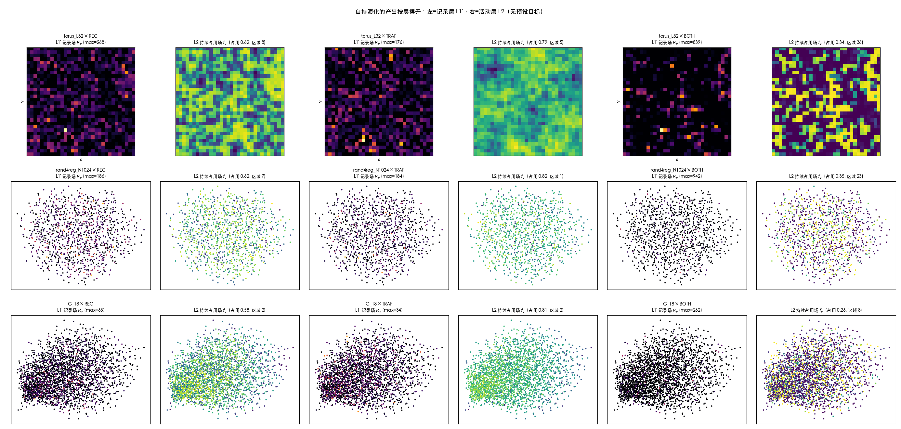

# 自持演化：各层产生的东西（逐层看）

> **等级：【数值证据】。** 引擎 [`z0_evo.py`](z0_evo.py)｜观测台 [`evo_survey.py`](evo_survey.py)
> 数据 `results/z0_evo.json`、`results/evo_survey.json`｜图 [`evo_layers.png`](evo_layers.png)
> **没有预设目标**：无维数扫描、无缺陷势、无粒子/光锥指标。

架构（无自由参数）：走者数守恒的自持环 ＋ 邻居权重读**记录层**（`D222` 最高两层保留 ⟹ $w\propto1+\min(R,2)$）
或读**边流量**（$w\propto1+T_{uv}$，Hebbian）。三基底：$\mathbb Z^2$ 环面、随机 4-正则图、原生 $\mathcal G_{18}$。

---

## 图：左列 = 记录层 L1′，右列 = 活动层 L2



**一眼能看出的两件事**：**L1′ 是斑点（speckle），L2 是畴（domains）**——同一套动力学，两层形态完全不同。

---

## L0：拓扑不变，但**长出了主干道**

| 观测 | REC | TRAF | BOTH |
|:--|--:|--:|--:|
| 平均度 | 4.000（常数 6/9） | 4.000 | 4.000 |
| 三角形/聚类系数 | 0（恒零 6/9） | 0 | 0 |
| **边流量 Gini** | **0.00** | **0.28–0.58** | **0.80–0.90** |
| 闭合事件（20000 步） | 30 996 | 21 265 | 48 986 |

$$
\Longrightarrow\ \textbf{边拓扑没动（度/三角形都是常数），但"哪些边在被走"自己分化了}
\ \Longrightarrow\ \textbf{L0 自发长出"主干道"}
$$

## L1′（记录层）：斑点、对数熵、**会变老的时钟**

| 观测 | 值域（9 次运行） | 结构分类（多数票） |
|:--|:--|:--|
| 记录总数 | 2.1万 – 7.7万 | power-law 增长 6/9 |
| **记录速率** | 1.02 – 1.94 /步 | **power-law 9/9（非平稳）** |
| Gini | 0.58 – 0.86 | 混合（power-law/stretched/log） |
| 最大占比 | 0.0034 – 0.024 | power-law 6/9（**不凝聚**） |
| **熵** | 5.4 – 7.2 | **logarithmic 8/9** |
| 远足平均长度 | 316 – 2 610 | logarithmic 7/9 |
| 热点占比（前 1%） | 0.051 – 0.165 | power-law 8/9 |

**两条新东西**：

1. **形态是斑点**（图左列）：记录集中在散落的个别格点上，不是成片的。
2. **时钟不稳、会变老**：记录速率单调衰减 —— REC $2.27\to1.38$、TRAF $1.52\to1.03$、BOTH $4.71\to1.94$。
   机制直白：走者一开始挤在起点附近（回返率高），扩散开后回返率下降 ⟹ 记录产生率随之衰减。
   **这是"老化"结构，而且是自发的**（没有任何外加时钟）。

## L2（活动层）：畴、正自相关、稳态生灭

| 观测 | 值域 | 结构（多数票） |
|:--|:--|:--|
| 区域数（判据 A） | **1 – 36** | power-law 漂移 6/9 |
| 占用率 | 0.28 – 0.83 | logarithmic 5/9 |
| 区域尺寸 均值/最大 | 10.9–2 230 / 53–2 230 | 混合 |
| **空间自相关 ac1** | **0.19 – 0.66** | 混合（log/stretched） |
| **出生 / 死亡（每窗）** | 0–4 / 0–4 | **constant 8/9** |

$$
\Longrightarrow\
\begin{aligned}
&\textbf{① 形态是畴}（图右列）：活动组织成成片的连通区域，尺度远大于记录斑点；\\
&\textbf{② 生灭速率在稳态下是常数}：区域在持续地生→死→再生，速率稳定（不是冻结图案）；\\
&\textbf{③ 区域数本身在漂移}（power-law 6/9）—— 系统还没到完全平稳，仍在缓慢重排。
\end{aligned}
$$

## 跨层：两种读法给出两种层间关系

| 模式 | $\mathrm{corr}(R_v,\,f_v)$ | 读法 |
|:--|--:|:--|
| REC | **0.67 – 0.71** | 活动跟着**记录**走 ⟹ 两层同形 |
| TRAF | **0.24 – 0.28** | 活动跟着**路**走 ⟹ **两层解耦**（记录与活动几乎无关） |
| BOTH | 0.61 – 0.68 | 两者耦合 |

$$
\Longrightarrow\ \textbf{层间是否"同形"不是必然的，取决于回灌读的是哪一层}
$$

## 全体结构目录（24 条时间序列 × 9 次运行，自动分类、无人挑选）

| 结构标签 | 条数 |
|:--|--:|
| power-law | 73 |
| logarithmic | 53 |
| stretched | 40 |
| constant | 28 |
| identically-zero | 9 |
| exponential | 4 |

另检测到 **58 处突变**（相邻窗口相对跳变 > 50%），多数集中在**前 1–2 个窗口**（瞬态）
以及 TRAF 模式下"区域数 9→3、平均区域尺寸 77→267"这类**畴粗化事件**。

---

## 这轮"长出来"了什么（一句话一条）

1. **主干道**（L0 边流量分化，Gini 0→0.9）
2. **斑点式记录层**（L1′）+ **对数增长的记录熵**
3. **会变老的原生时钟**（记录速率自发衰减）
4. **畴式活动层**（L2，空间正自相关 0.19–0.66）
5. **稳态的区域生灭循环**（生/死速率常数，区域数 1–36）
6. **层间可耦合可解耦**（取决于回灌读记录还是读流量）

**没长出来的**（诚实登记）：任何像"时空"或"粒子"的东西。这里出现的结构是
斑点/畴/主干道/老化时钟——**都是统计与几何结构，没有一个自带度规、光锥或质量谱**。

## 复现

```bash
cd /Users/oygb/Downloads/lh/zerogpu
/usr/bin/python3 z0_evo.py        # 3 基底 × 3 模式 × 24 条时间序列，140 s
/usr/bin/python3 evo_survey.py    # 逐层场 + 画图，149 s
```
